# ყავის ლაბორატორია — ტექნიკის კატალოგი

*Coffee Laboratory — Equipment Catalog*

**Brands:** 9 · **Products:** 44 · **Product images:** 75  
Source: `ყავის-ლაბორატორია-ტექნიკა-.pdf-1_6a10e574-4905-49d3-a860-c3515c8d4f15 (1).pdf (2) (1) (2).pdf` · Generated: 2026-06-28

> description_ka is raw text extracted from the PDF and may need light editing. Images are the main product photos per item (brand logos, icons and decorative bars were filtered out).

---

## Huskee

Huskee — ინოვაციური და ეკოლოგიურად სუფთა ყავის ჭიქებია, რომლებიც დამზადებულია
ყავის მარცვლის გადამუშავებული ქერქისგან. ეს უნიკალური მასალა უზრუნველყოფს
სასმელის ტემპერატურის ხანგრძლივად შენარჩუნებას, არის გამძლე და ყოველდღიური
გამოყენებისთვის პრაქტიკული.
Huskee-ს ჭიქები გამოირჩევა მსუბუქი, თანამედროვე და მინიმალისტური დიზაინით, რომელიც
კომფორტულია როგორც ხელში დასაჭერად, ისე ბარისა და კაფის ყოველდღიურ სამუშაოში
გამოსაყენებლად.

### Huskee Cups, Plates & Lids (8oz / 6oz)

*PDF page 3 · id: `huskee-cups-plates`*

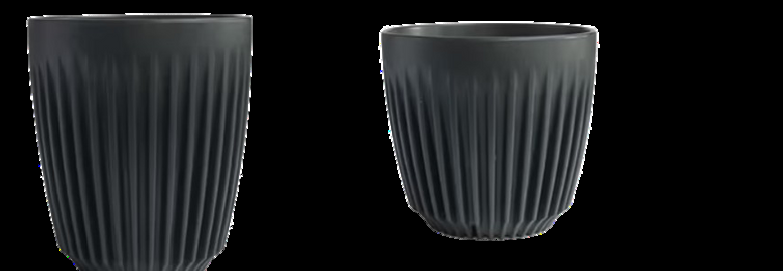
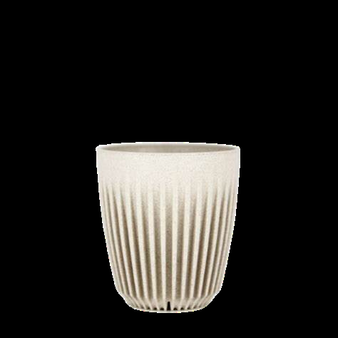
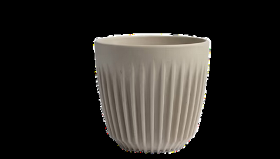
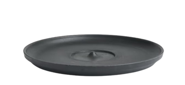
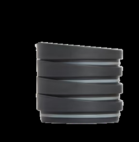
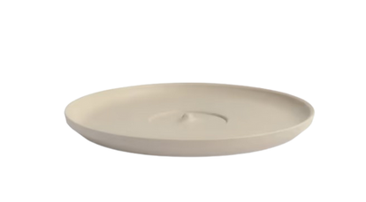

Huskee 8oz Black
Huskee 8oz Natural
Huskee 6oz Black
Huskee 6oz Natural
Huskee plate black
Huskee plate Natural
Huskee Lids Black

---

## Hario

,
Hario — იაპონიიდან წარმოშობილი უმაღლესი ხარისხის და ინოვაციური
აღჭურვილობა ყავის მოსამზადებლად. ბრენდი აღიარებულია როგორც
პროფესიონალი, ასევე მოყვარული ბარისტების არჩევანი.
დახვეწილი დიზაინისა და მაღალი ფუნქციონალის შერწყმით, Hario-ს პროდუქცია
აერთიანებს გამძლე მასალებსა და სრულყოფილ შესრულებას.
HARIO სპეციალიზდება სითბოგამძლე ბოროსილიკატური მინის წარმოებაში —
სპეციალური მინა, რომელიც მდგრადია სითბოსა და ქიმიური ზემოქმედების მიმართ,
დაცულია ბზარებისა და ტემპერატურის მკვეთრი ცვლილებებისგან. ეს მინა
გამჭვირვალე, მსუბუქი და ეკოლოგიურად სუფთაა.
.
თავდაპირველად იგი გამოიყენებოდა ლაბორატორიულ და სამედიცინო ჭურჭელში,
 სადაც სიზუსტე და უსაფრთხოება კრიტიკულად მნიშვნელოვანია,
ხოლო მოგვიანებით ფართოდ დაინერგა ყავისა და ჩაის აქსესუარებში — 
იქ, სადაც მინის სისუფთავე და სითბოს კონტროლი გადამწყვეტ როლს ასრულებს.

### Hario Stainless Server 600ml

*PDF page 5 · id: `hario-stainless-server-600`*

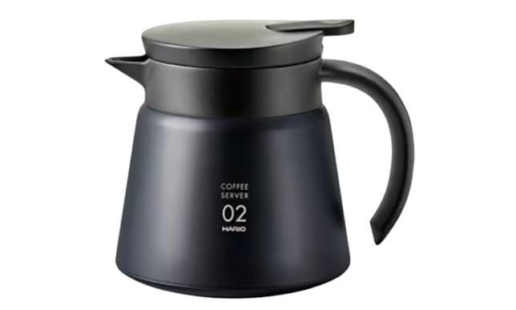

HARIO STAINLESS SERVER 600ML
სერვერი
აქვს თერმო ფუნქცია და ინარჩუნებს ტემპერატურას

---

## AeroPress

Aeropress – გლობალურად აღიარებული ბრენდი, რომელიც
ყავის მომზადების ინოვაციურ მეთოდს გვთავაზობს. მისი
უნიკალური დიზაინი და მარტივი გამოყენება საშუალებას
აძლევს ყავის მოყვარულებს, მოამზადონ არომატული ყავა.
Aeropress-ის პროდუქცია აერთიანებს ხარისხს, კომფორტს
და ექსპერიმენტირების შესაძლებლობას, რაც მას
განსაკუთრებულად მიმზიდველს ხდის ყავის
ენთუზიასტებისთვის.
AEROPRESS არის ამერიკული ბრენდი
ყავის მომზადების ინოვაცია – ადლერმაAEROPRESS 2005
წელს შექმნა, რადგან უკმაყოფილო იყო ტრადიციული
მეთოდებით მომზადებული ყავით – სურდა უფრო სუფთა
და დაბალმჟავიანი სასმელი
მზადდებოდა
, რომელიც სწრაფად
.

### AeroPress & AeroPress Go

*PDF page 7 · id: `aeropress-original-go`*

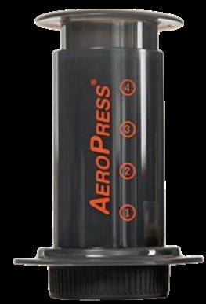
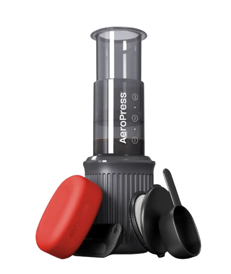

Aeropress
 
Aeropress Go
 
, 
შეძენისას მიყვებაფილტრები, კოვზი და
მოსარევი
შეძენისას მიყვებაფილტრებიკოვზი და მოსარევი
მეტად კომორტულია სატარებლად, აქვს ჭიქა და
თავსახური

**Video:** https://www.youtube.com/watch?v=97VYBfxn2KI · https://www.youtube.com/watch?v=f2XFwB8uCUY

### AeroPress Clear / Clear Blue

*PDF page 8 · id: `aeropress-clear`*

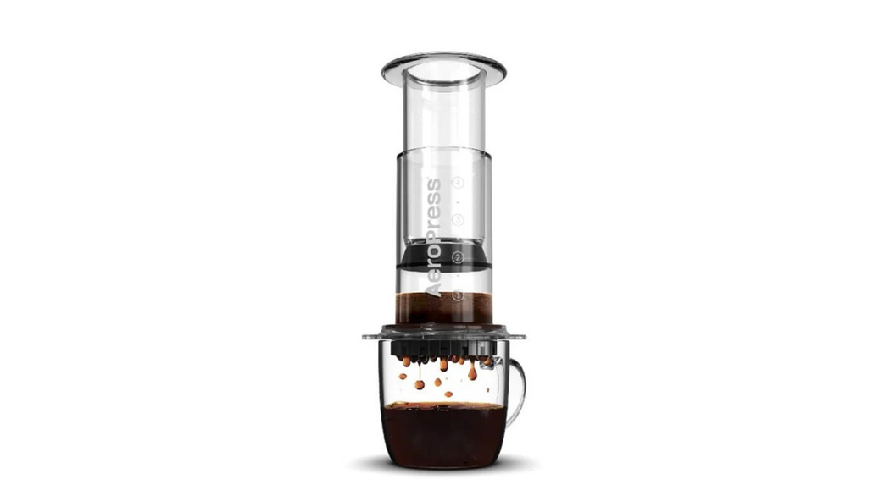
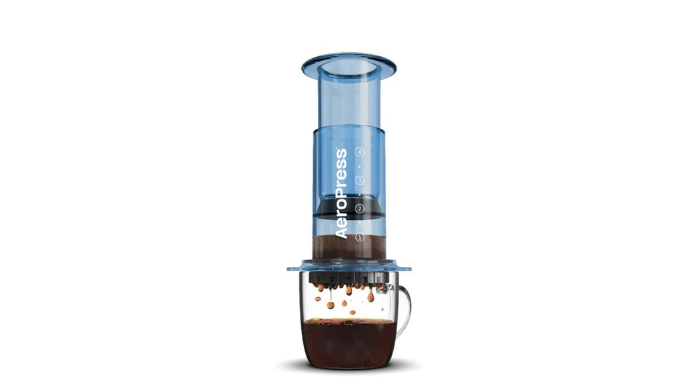

AeroPress
Aeropress Clear
Aeropress Clear Blue
შეძენისას მიყვება ფილტრები, კოვზი და
 მოსარევი

**Video:** https://www.youtube.com/watch?v=97VYBfxn2KI

### AeroPress Paper Filters (350 pcs)

*PDF page 9 · id: `aeropress-paper-filters`*

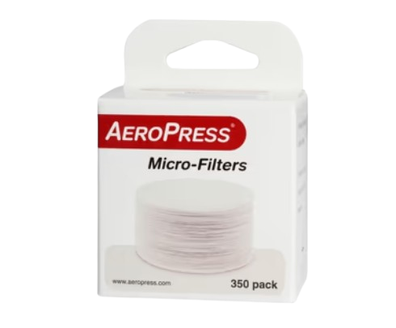

ერთჯერადი ქაღალდის
ფილტრები
შეფუთვაში არის 350
ცალი

---

## Fellow

Fellow – ინოვაცია, დიზაინი და სრულყოფილი ყავის
მომზადება ერთ ბრენდში. Fellow ქმნის თანამედროვე,
ესთეტიკურად მიმზიდველ და ფუნქციურ მოწყობილობებს,
რომლებსაც ყავის მომზადება ახალ დონეზე აჰყავს 
.
FELLOW არის ამერიკული ბრენდი, რომელიც დაარსდა
სან-ფრანცისკოში, კალიფორნიაში, ხოლო მისი
პროდუქციის წარმოება ხდება ჩინეთში
სპეციალიზირებულია პრემიუმ კლასის ყავის
მოწყობილობებსა და აქსესუარებში
. იგი
ყავის მოსამზადებელ პროდუქტებში.

### Fellow Prismo (AeroPress attachment)

*PDF page 11 · id: `fellow-prismo`*

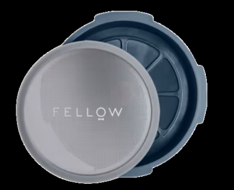
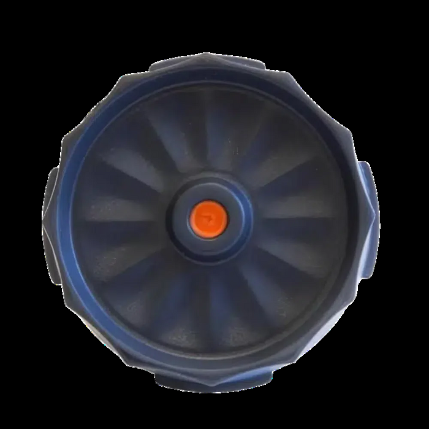

.
.
Fellow Prismo არის აეროპრესისთვის განკუთვნილი
ინოვაციური დანამატი, რომელიც საშუალებას
გაძლევთ მოამზადოთ უფრო ინტენსიური, მდიდარი
და ესპრესო-სტილის ყავა.
Prismo აღჭურვილია სპეციალური წნევის
სარქველით, რომელიც წყალს არ ატარებს მანამ,
სანამ დაწოლას არ დაიწყებთ. ეს უზრუნველყოფს
წნევის დაგროვებას და ექსტრაქციის უკეთ
კონტროლს. სარქველის ცენტრალური
ნარინჯისფერი დეტალი ავტომატურად იხსნება
დაწოლისას და ქმნის უფრო კონცენტრირებულ
ყავას.
კომპლექტში შემავალი მრავალჯერადი უჟანგავი
ფოლადის ფილტრი ატარებს ყავის ბუნებრივ
ზეთებს, რის შედეგადაც სასმელი უფრო
ინტენსიური გემოსა და სქელი ტექსტურის ხდება —
განსხვავებით ქაღალდის ფილტრით მომზადებული
ყავისგან.
Fellow Prismo იდეალურია მათთვის, ვისაც სურს:
ძლიერი და კონცენტრირებული ყავა
ესპრესო-სტილის შედეგი აეროპრესით
ეკოლოგიური და მრავალჯერადი ფილტრის
გამოყენება

### Fellow Aiden Brewer – Black

*PDF page 12 · id: `fellow-aiden-brewer`*

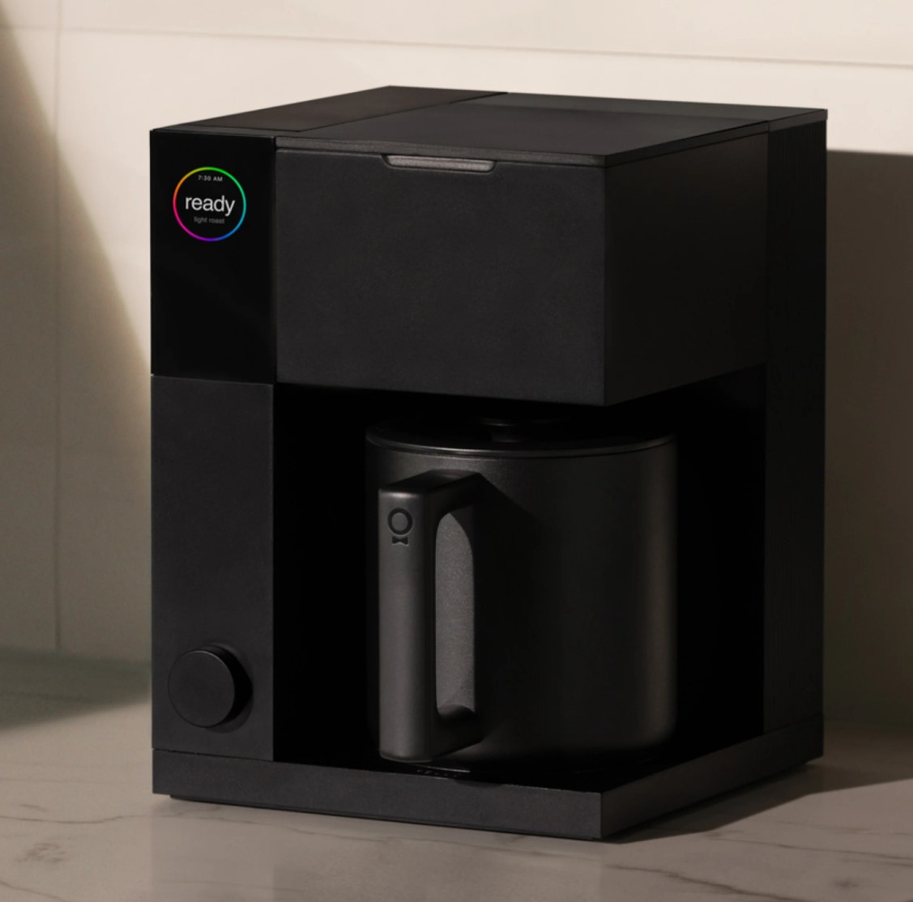

Fellow AIDEN Brewer – Black
Fellow AIDEN Brewer არის ახალი თაობის ავტომატური ყავის
აპარატი, რომელიც სპეციალურად შექმნილია სპეციალური კლასის
(Specialty) ყავის მარტივად და სტაბილური ხარისხით
მოსამზადებლად.
მისი მთავარი უპირატესობა ისაა, რომ მომხმარებელს არ სჭირდება
ბარისტის გამოცდილება — აპარატი თავად აკონტროლებს ყველა
მნიშვნელოვან პარამეტრს, რათა ყავა ყოველ ჯერზე ერთნაირად
გემრიელი გამოვიდეს.
როგორ მუშაობს:
აპარატს აქვს წინასწარ დაპროგრამებული მოხარშვის რეჟიმები
თავად აკონტროლებს წყლის ტემპერატურას
უზრუნველყოფს ყავის სწორ ექსტრაქციას
შედეგი ყოველთვის სტაბილურია — ფინჯნიდან ფინჯნამდე
ეს ნიშნავს, რომ:
 ერთხელ დააყენებთ და შემდეგ ყავა ყოველთვის ერთნაირი
ხარისხის იქნება
რატომ არის AIDEN კარგი არჩევანი?
☕ ამზადებს მაღალხარისხიან, არომატულ ყავას
🤖 მუშაობს ავტომატურად — მინიმალური ჩარევით
🎯 შედეგი სტაბილურია, შეცდომის რისკი მინიმალურია
🖤 დიზაინი თანამედროვე და მინიმალისტურია
🏠 შესაფერისია როგორც სახლისთვის, ასევე ოფისისა და
კაფისთვის

**Video:** https://www.youtube.com/watch?v=lUFTOeT9fcE

### Fellow Stagg EKG Electric Kettle

*PDF page 13 · id: `fellow-stagg-ekg-kettle`*

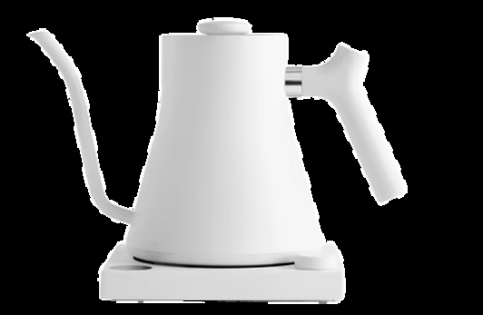
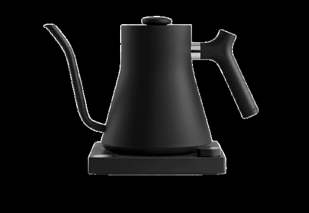
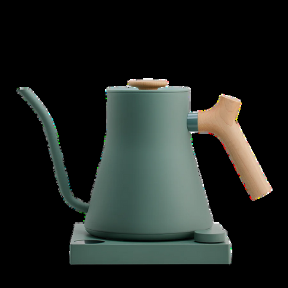

Fellow-ს ელექტრო ჩაიდანი
უპირატესობები
ტემპერატურის საზომი - შეგვიძლია კონკრეტულ
ტემპერატურაზე დავაყენოთ და გავაცხელოთ
ინარჩუნებს ტემპერატურას 60 წუთის განმავლობაში
აქვს გუსქნექი, რაც განაპირობებს წყლის დასხმის
კონტროლს
 Fellow stagg EKG
 Fellow stagg EKG
 Fellow stagg EKG
ფილტრის ყავის მომზადებისას წყლის დასხმის კონტროლი
მნიშვნელოვანია, რადგან ის გავლენას ახდენს ექსტრაქციაზე, რაც
საბოლოოდ ყავის გემოს განსაზღვრავს.
 სწორი გაჯერება – წყლის თანაბარი დასხმით ყავა სწორად იხსნება
და მიიღება უფრო დაბალანსებული არომატი.
 თანაბარი ექსტრაქცია – თანაბარი და ნელი დასხმა
უზრუნველყოფს ყველა ყავის ნაწილაკის ერთგვაროვან გახსნას,
რაც თავიდან აცილებს გადაჭარბებულ სიმწარეს ან წყლიანობას.
 სასურველი გემო და სხეული – სწორი ტექნიკა იძლევა
სრულფასოვან, არომატულ და დაბალანსებულ სასმელს.

**Video:** https://www.youtube.com/watch?v=cgmAi6zGTKs

### Fellow Corvo EKG Electric Kettle

*PDF page 14 · id: `fellow-corvo-ekg-kettle`*

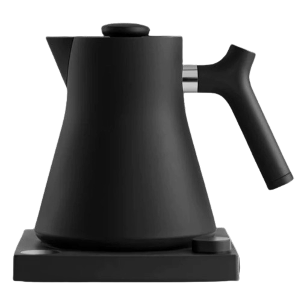

Fellow-ს ელექტრო ჩაიდანი
უპირატესობები
ტემპერატურის საზომი, შეგვიძლია
კონკრეტულ ტემპერატურაზე დავაყენოთ და
გავაცხელოთ
ინარჩუნებს ტემპერატურას 60 წუთის
განმავლობაში
ამ კონკრეტულ მოდელს არ აქვს გუსნექი,
ამიტომ ფილტრის ყავებისთვის არ ვუწევთ
რეკომენდაციას
Fellow Corvo EKG

**Video:** https://www.youtube.com/watch?v=R2kQdrtYydY

### Fellow Atmos Canister – Glass, 0.7L

*PDF page 15 · id: `fellow-atmos-glass-07`*

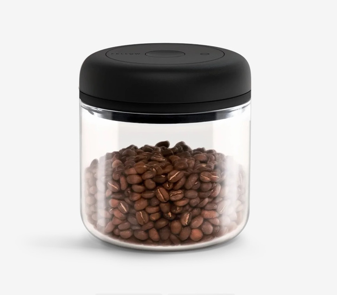
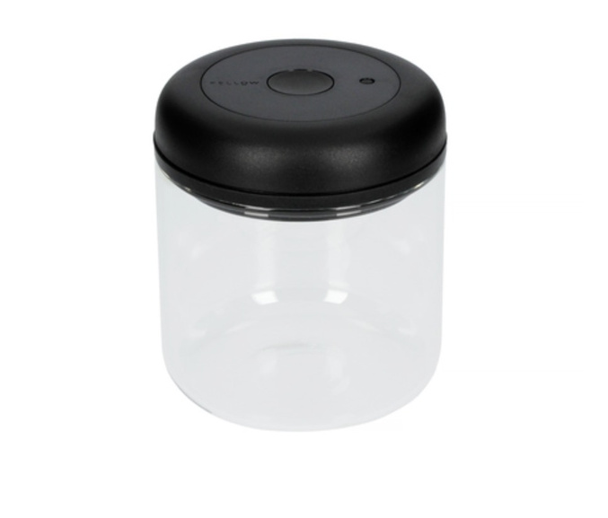

Fellow Atmos Canister – Glass, 0.7L
მოკლე აღწერა
ვაკუუმურიკონტეინერი, რომელიც დიდხანს
ინახავს და ინარჩუნებს ყავის მარცვლების
სისუფთავესა და არომატს.
ძირითადი მახასიათებლები
მოცულობა: 0.7 ლ
მინისკორპუსი
ვაკუუმურიჩამკეტისისტემა
იდეალურიაყავისმარცვლებისთვის
BPA-free

### Fellow Atmos Canister – Matte Black, 0.7L

*PDF page 16 · id: `fellow-atmos-matte-07`*

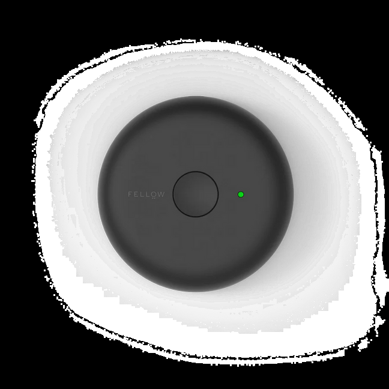
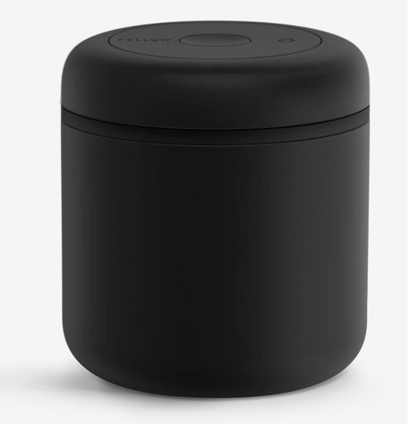

ვაკუუმური ქილა ინარჩუნებს ყავის,
ჩაის ან სხვა მშრალი პროდუქტების
არომატს.
სპეციფიკაციები:
ფერი: Matte Black
ტევადობა: 0.7L
ფუნქცია: ვაკუუმური დახურვა
არომატის დასაცავად

### Fellow Mighty Small & Stagg Carafes

*PDF page 17 · id: `fellow-carafes`*

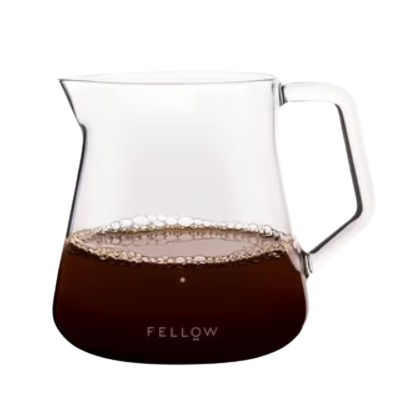
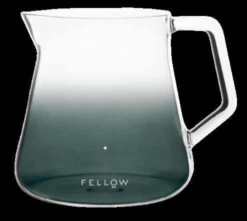
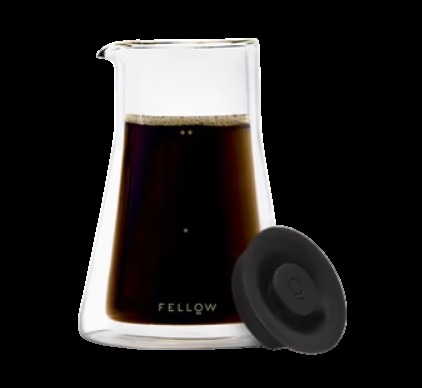

FELLOW MIGHTY SMALL
CARAFE (SMOKED GLASS)
FELLOW MIGHTY SMALL
CARAFE (CLEAR)
FELLOW STAGG DOUBLE
WALLED CARAFE

### Fellow Eddy Milk Pitcher 12oz

*PDF page 18 · id: `fellow-eddy-pitcher-12oz`*

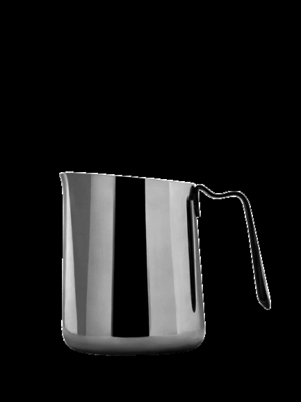

Fellow-ის pitcher გამოირჩევა
განსაკუთრებული ცხვირის დიზაინით, რაც
ლატე არტისთვის ზუსტ კონტროლს იძლევა.
ერგონომიული სახელური და პრემიუმ
ფოლადი კომფორტსა და გამძლეობას
უზრუნველყოფს. შიდა საზომი ნიშნულები
და ოპტიმიზებული ფორმა კი იდეალური
რძის ტექსტურას ქმნის
Eddy milk Pitchers
12 Oz

### Fellow Opus Conical Burr Grinder

*PDF page 19 · id: `fellow-opus-grinder`*

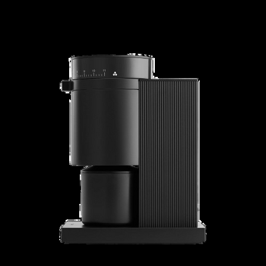
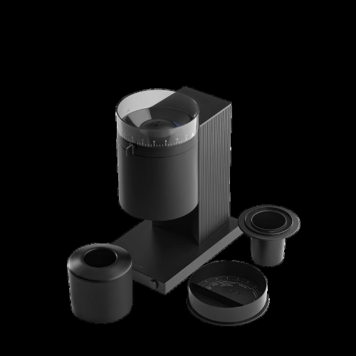
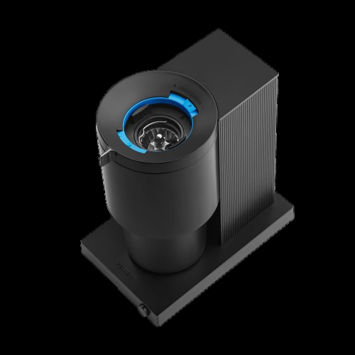
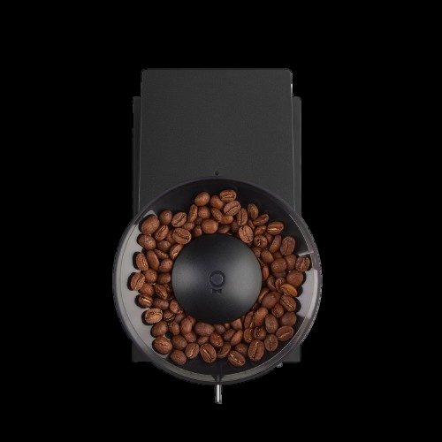
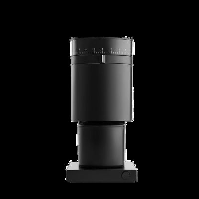

Opus Conical Burr Grinder არის
მრავალფუნქციური, პრემიუმ ხარისხის
საფქვავი, რომელიც უზრუნველყოფს ზუსტ
დაფქვას როგორც ესპრესოებისთვის, ასევე
pour-over, ფრენჩ პრესისა და ცივი ყავისთვის.
 6 ძირითადი + 41 მიკროკონფიგურაცია –
იძლევა დაფქვის სრულ კონტროლს
ნებისმიერი მეთოდისთვის.
 ბროლის ფორმის კონუსური დისკოები
(Conical Burrs) – არომატის მაქსიმალური
გაშლა და თანაბარი დაფქვა.
 ტურბო ძრავი და დაბალი ხმაურის სისტემა –
სწრაფი და მშვიდი დაფქვა.
 სტილური და კომპაქტური დიზაინი –
იდეალურია სახლისთვის, პროფესიონალური
ხარისხით.

### Rocky Lowball Tumbler – Matte Black, 10oz

*PDF page 20 · id: `rocky-lowball-tumbler-10oz`*

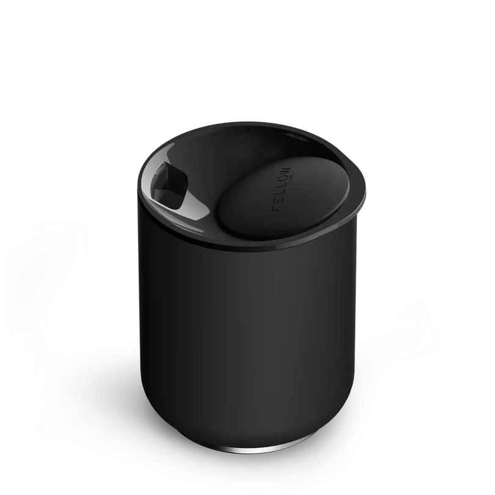

Rocky Lowball Tumblers Matte Black, 10 oz
/ 295ml(REXMB10)
,
ელეგანტურიშავი ზედაპირისჭიქა
დამზადებულია ორმაგი კედლის
კონსტრუქციით,რომელიც ინარჩუნებს
სასმელისტემპერატურას.
სპეციფიკაციები:
ფერი: Matte Black
მოცულობა: 10 oz / 295 ml
მასალა: ორმაგი კედლის უჟანგავი
ფოლადი

### Fellow Carter Wide Mug

*PDF page 21 · id: `fellow-carter-wide-mug`*

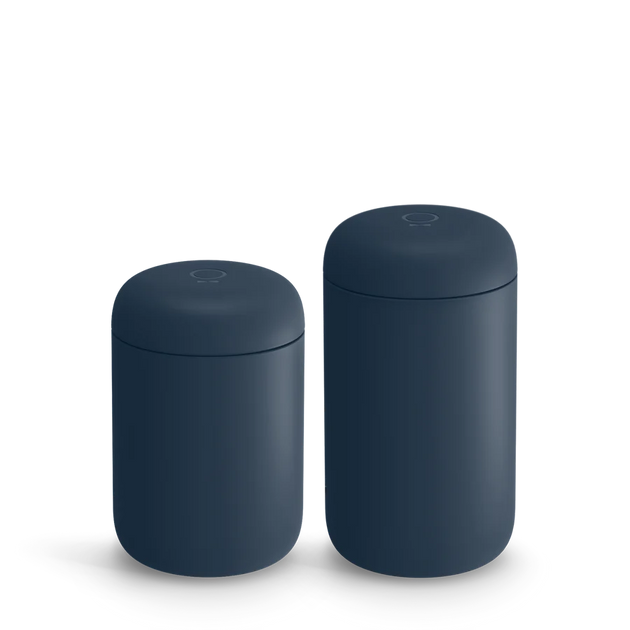
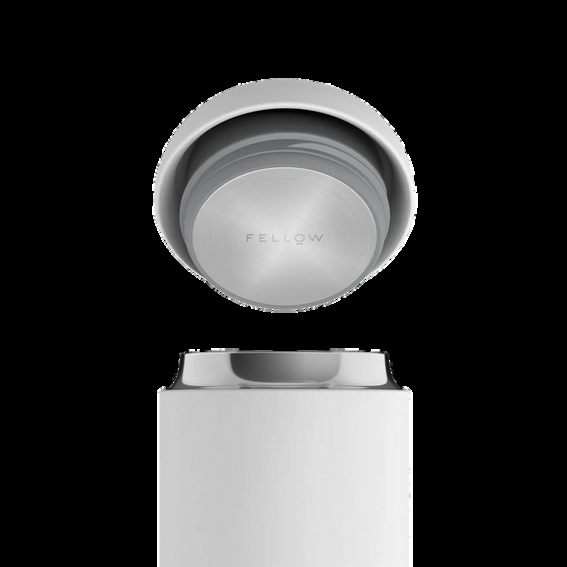

Carter Wide Mug
ჭიქის ზედაპირი დახვეწილი და
მინიმალისტურია. ორმაგი კედელი
ხელს უწყობს სასმელის ტემპერატურის
შენარჩუნებას.
სპეციფიკაციები:
ფერი: Matte White, Stone Blue, Black
მოცულობა: 12 oz / 354 ml
მასალა: ორმაგი კედლის უჟანგავი
ფოლადი

### Fellow Carter Slide Cup 12oz – Hazy Blue

*PDF page 22 · id: `fellow-carter-slide-12oz`*

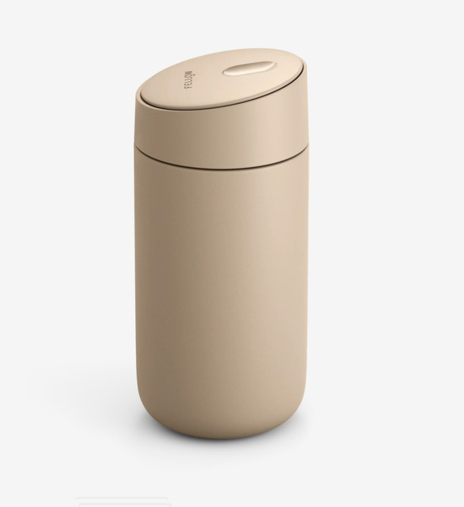
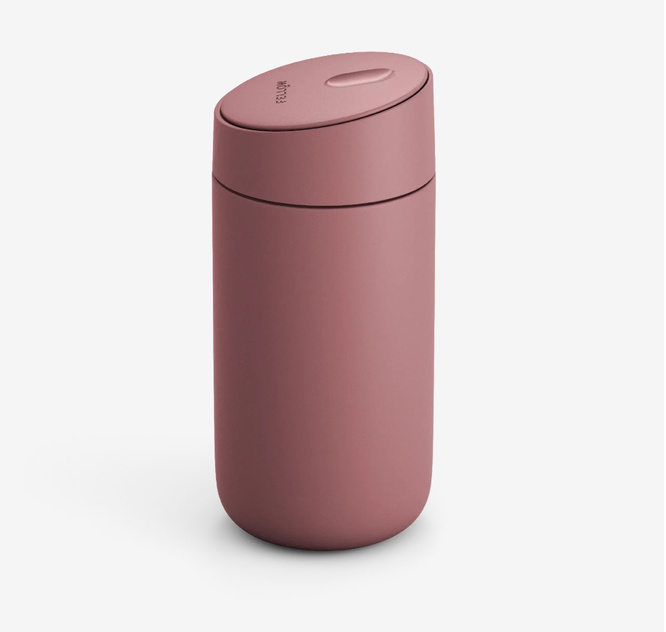
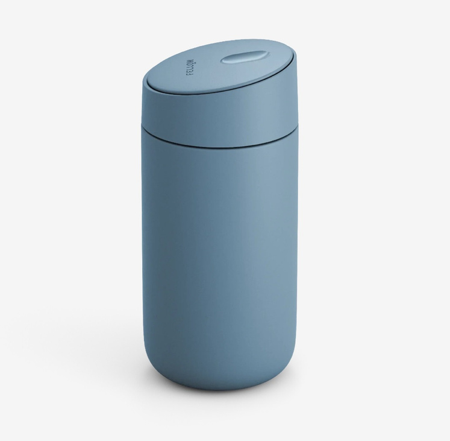
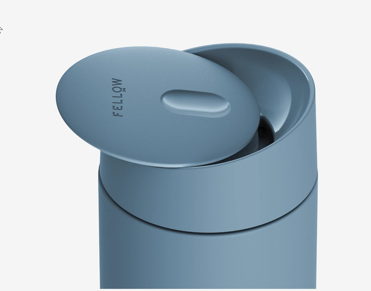

Fellow Carter-ის სლაიდ-ფინჯანი – 12oz
/ 354 მლ
თანამედროვე სამოგზაურო ჭიქა
დამამშვიდებელი Hazy Blue ფერით და
პრაქტიკული, ყოველდღიური
გამოყენებისთვის განკუთვნილი
სლაიდ-სახურავით.
ძირითადი მახასიათებლები
• მოცულობა: 12 oz (354 მლ)
• მასალა: უჟანგავი ფოლადი,
კერამიკული საფარით დაფარული
შიდა ნაწილი
• ფერი: Hazy Blue
• სლაიდ-სახურავი
• ორმაგი კედლის ვაკუუმური
იზოლაცია
• BPA-ს გარეშე

### Fellow Carter Lids (Move / Slide / Cold + Straw)

*PDF page 23 · id: `fellow-carter-lids`*

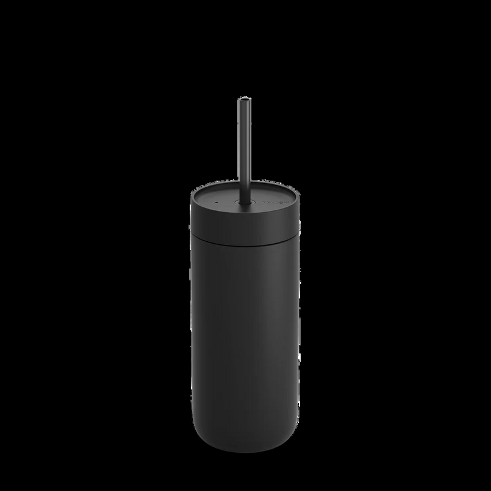
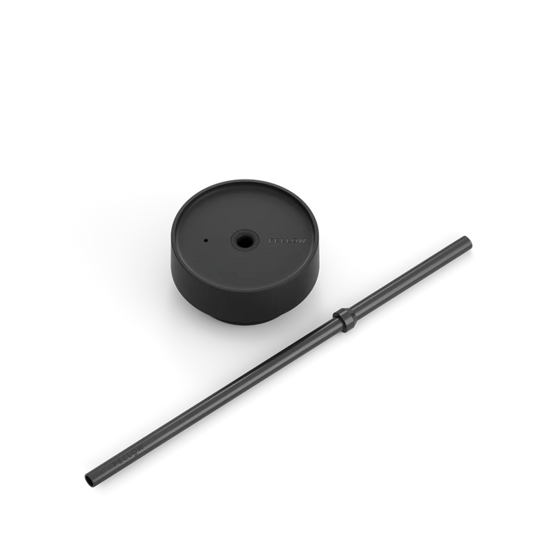

Move, Slide, Cold Lid + Straw – მრავალფუნქციური ჭიქა
სახურავები სხვადასხვა საჭიროებისთვის:
Slide Lid (ცხელი სასმელებისთვის): უსაფრთხო სლაიდ-სისტემა, 
რომელიც საშუალებას გაძლევთ მარტივად მიირთვათ ცხელი სასმელი, 
დაიცვას წვეთებისგან და შენარჩუნდეს სასმელის ტემპერატურა.
Cold Lid + Straw (ცივი სასმელებისთვის): იდეალურია ყინულიან სასმელებსა 
და გრილ ნაყინიან სასმელებზე, საწრუპის საშუალებით მარტივი
 და მოსახერხებელი სასმელის მიღება.
გამძლეობა და ფუნქციონალობა:
ორმაგი კედლის უჟანგავი ფოლადი ინარჩუნებს სასმელის ტემპერატურას
 ხანგრძლივი დროის განმავლობაში.
მონაწილეების ხარისხი უზრუნველყოფს უსაფრთხო გამოყენებას,
 გამძლეობას და კომფორტულ მომსახურებას ყოველდღიურ
 ან მოგზაურობის პირობებში.
ელეგანტური Matte Black ფერი ხაზს უსვამს ჭიქის დიზაინსა და პრესტიჟს.
სპეციფიკაციები:
მოცულობა: 16 oz / 473 ml
მასალა: ორმაგი კედლის უჟანგავი ფოლადი
სახურავები: Slide Lid + Cold Lid + Straw
ფერი: Matte Black
✅ Move ჭიქა – იდეალური არჩევანი მათთვის, ვინც მოხერხებულობას,
 სიმძლავრეს და თანამედროვე დიზაინს ერთიანად ეძებს.

### Fellow Carter Move Mug 16oz – Smoke Green

*PDF page 24 · id: `fellow-carter-move-16oz`*

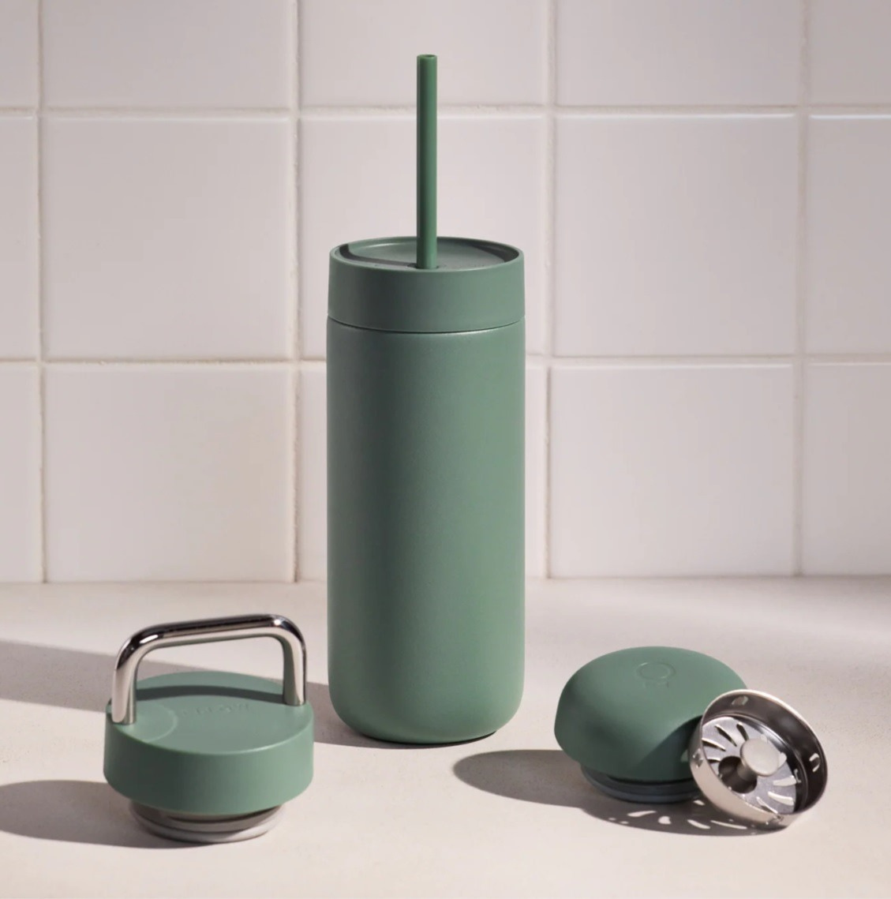

Fellow Carter Move Mug – 3-in-1 Lid,
Smoke Green, 16oz
მოკლე აღწერა
მრავალფუნქციურითერმოჭიქა 3-in-
1 სახურავით —
ცხელიდაცივისასმელებისთვის.
ძირითადი მახასიათებლები
მოცულობა: 473 მლ (16oz)
3 სახურავი: Regular / Carry / Cold +
Straw
კერამიკულიშიდასაფარი
ვაკუუმურიიზოლაცია
BPA-free

### Fellow Carter 3-in-1 16oz – Matte White

*PDF page 25 · id: `fellow-carter-3in1-16oz`*

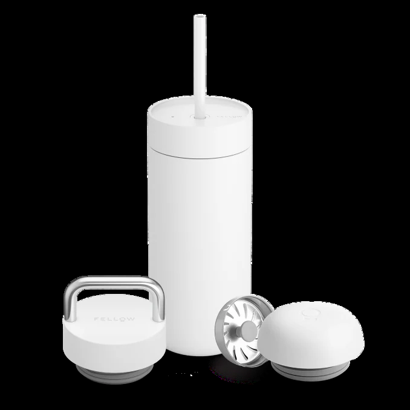

Carter 3-in-1 Lid System
 3-1-
უნიკალური 
შისახურავისსისტემა
საშუალებას გაძლევთადვილად
გადაერთოთ სხვადასხვა რეჟიმზე:
დალევამოძრაობაში, ტარება ან ცივი
სასმელი საწრუპით.
სპეციფიკაციები:
ფერი: Matte White
მოცულობა: 16 oz / 473 ml
სახურავი: 3-1-ში (Move, Carry, Cold Lid +
Straw)
მასალა: ორმაგი კედლის უჟანგავი
ფოლადი

### Fellow Stagg [X] Pour-Over Dripper

*PDF page 26 · id: `fellow-stagg-dripper-x`*

![Fellow Stagg [X] Pour-Over Dripper](technika_images/fellow-stagg-dripper-x.png)

Stagg Pour-Over Dripper
პროფესიონალურდონეზე მოსახარშად
 
შექმნილი დრიპერი, რომელიც
უზრუნველყოფს წყლის თანაბარ
განაწილებას ყავაზე. ასე მიიღებთ
დახვეწილ გემოსა და არომატს თქვენს
ფინჯანში.
სპეციფიკაციები:
მოდელი: Stagg X
მასალა: უჟანგავი ფოლადი/
სურსათისთვის უსაფრთხო მასალები
გამოყენება: Pour-Over ყავის მომზადება

### Fellow Stagg X Filters (45 pcs)

*PDF page 27 · id: `fellow-stagg-x-filters`*

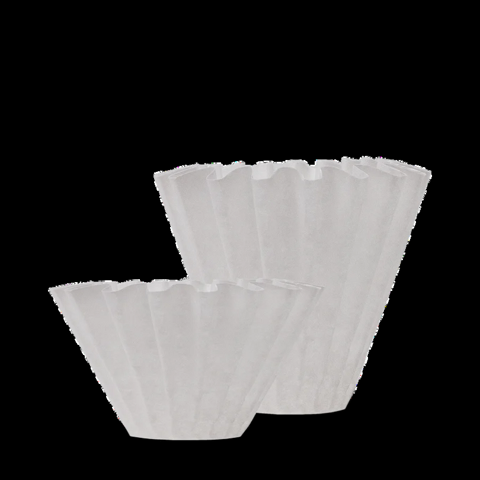

Stagg XFilters (packof45)(1135)
StaggX Dripper-
, 
დამატებითი ფილტრები
ისთვისრაც დაგეხმარებათ მიიღოთ
სუფთა, არომატული ყავა დღეში
რამდენჯერმეც კი.
სპეციფიკაციები:
მოდელი: Stagg X Filters
რაოდენობა: 45 ცალი
გამოყენება:Pour-Over ყავის
ფილტრაცია

### Fellow Clara French Press

*PDF page 28 · id: `fellow-clara-french-press`*

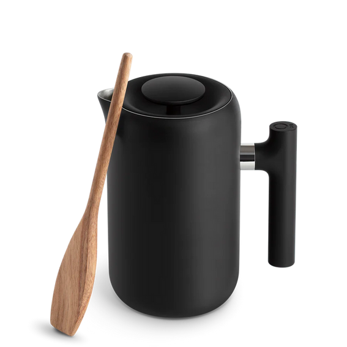
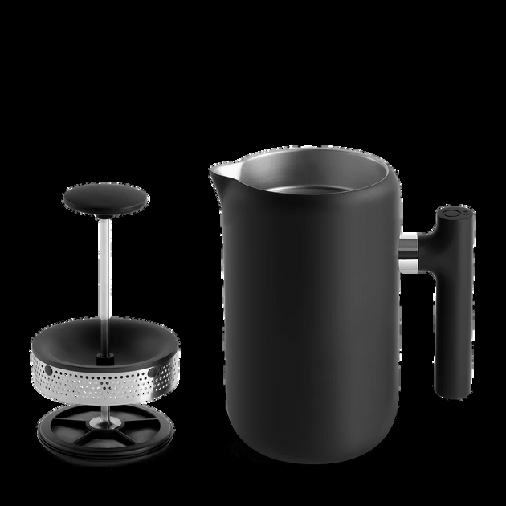

წარმოგიდგენთ Fellow Clara-ს, რომელიც
ცვლის კლასიკური ფრენჩ პრესის
გამოცდილებას! მისი ვაკუუმ-
იზოლირებული კედლები ინარჩუნებს
ოპტიმალურ ტემპერატურას, რომ
ყოველი მომდევნო ფინჯანი ისეთივე
არომატული და ცხელი იყოს, როგორც
პირველი. გაუმჯობესებული ფილტრი კი
უზრუნველყოფს სუფთა და ნაზ გემოს,
ყოველგვარი ნალექის გარეშე.
 მარტივი გამოყენება
შეავსე ნიშნულებამდე ,
– უბრალოდ 
ჩაწიე და მოურიე 
 მარტივი გასაწმენდი – არაწებოვანი
შიდა საფარი
 ელეგანტური და გამძლე დიზაინი

### Fellow Tally Pro Scale – Studio Edition

*PDF page 29 · id: `fellow-tally-pro-scale`*

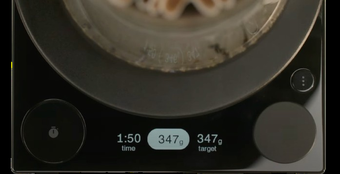
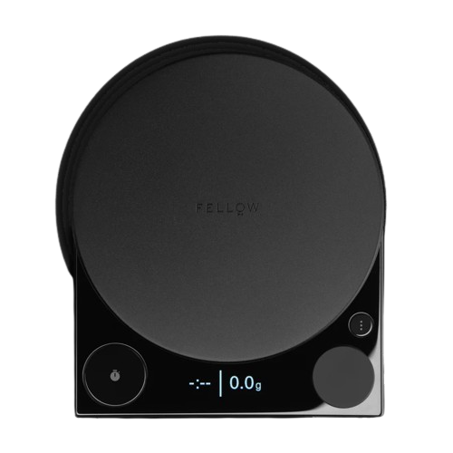

TALLY
SCALE PRO
STUDIO
EDITION
: 0,1
აქვსტაიმერიმინიმალურიწონა 
გ
მაქსიმალურიწონა:2,500 გ
სასწორზე შეგიძლიათ დააყენოთ
ყავის მომზადების „რეცეპტი“, რაც
დაგეხმარებათ იმაში, რომ
გააკონტროლოთ ყავის და წყლის
სწორი თანაფარდობა.

**Video:** https://www.youtube.com/watch?v=4uEuj28L74A

---

## Timemore

Timemore არის ჩინური ბრენდი - დახვეწილი დიზაინი და
ინოვაციური ფუნქციები ყავის მოყვარულებისთვის
ქმნის პრემიუმ ხარისხის ყავის აქსესუარებს
. ბრენდი
, რომლებიც
აერთიანებს ესთეტიკას, პრაქტიკულობას და სიზუსტეს.
იქნება ეს ხელის გრინდერები
მოწყობილობები
, სასწორები თუ სხვა
.

### Timemore Glass Coffee Dripper (V60)

*PDF page 31 · id: `timemore-v60-glass-dripper`*

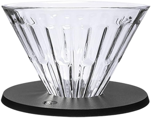
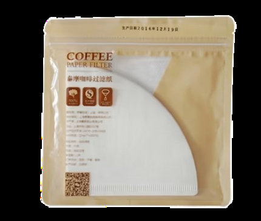

TIMEMORE Glass Coffee Dripper
 ,
v60 -
დრიპერი გამოიყენება
ისდასამზადებლად
TIMEMORE FILTER
 
თუ მომხმარებელმაარიცის დრიპერისზომა 
02 ზომა ფილტრს ., აუცილებლად
ვთავაზობთ 
თუ ფილტრი დიდია დრიპერზე გადაკეცვა შესაძლებელია , თუ
ფილტრი დრიპერზე პატარაა დიდია შანსი ფილტრი დაზიანდეს .

### Timemore Coffee Server – Transparent Black 600ml

*PDF page 32 · id: `timemore-coffee-server-600`*

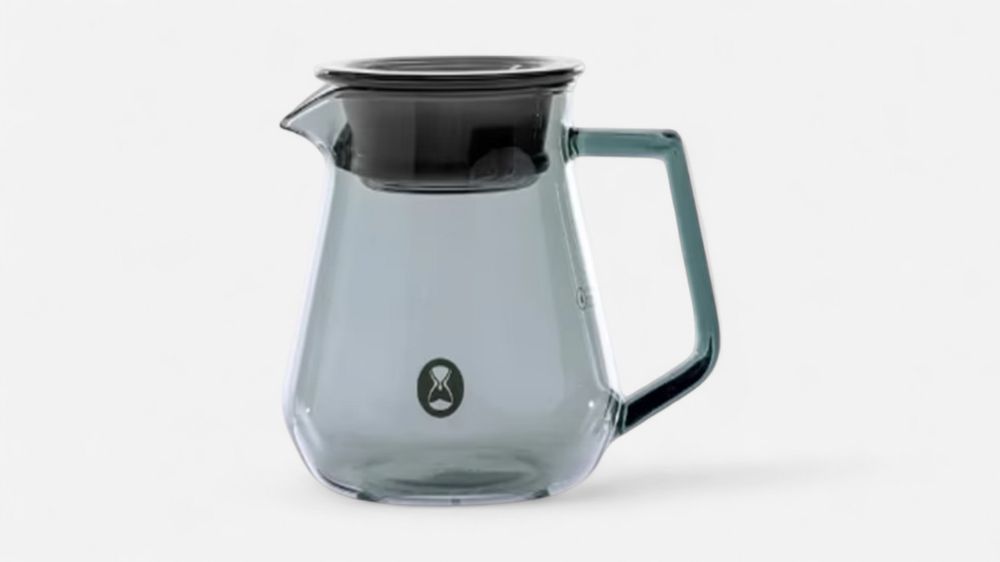
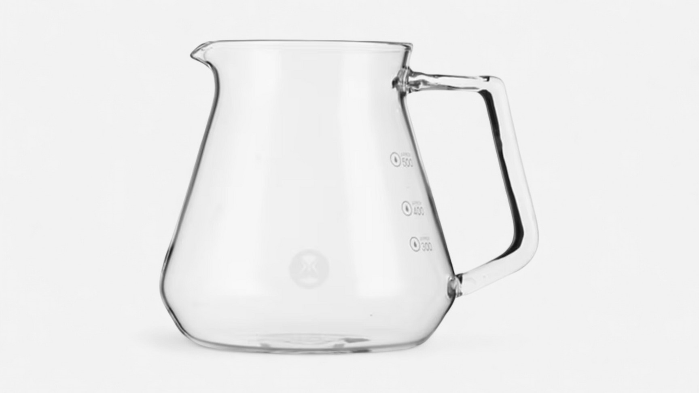

Timemore Coffee Server
Transparent Black | 600 ml
"Coffee Server Transparent | 600 ml"

### Timemore Fish Pure Pour-over Kettle 700ml

*PDF page 33 · id: `timemore-fish-pure-kettle`*

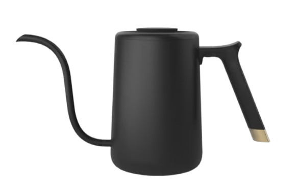
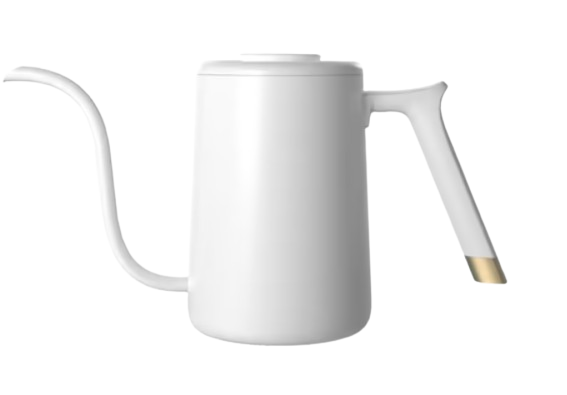

არ აქვს სადგამი და რეკომენდაციას ვუწევთ ინდუქციური გაზისთვის
ისევ და ისევ უპირატესობაში გვაქვს გუსნექი, რომელიც წყლის თანაბარი დასხმის საშუალებას
გვაძლევს
დამზადებულია უჟანგავი ფოლადისგან
ინარჩუნებს ტემპერატურას
ტევადობა 700 მლ
Timemore Fish Pure Pour-over Kettle
Timemore Fish Pure Pour-over Kettle

### Timemore Fish Pro Electric Pour-over Kettle 900ml

*PDF page 34 · id: `timemore-fish-pro-kettle`*

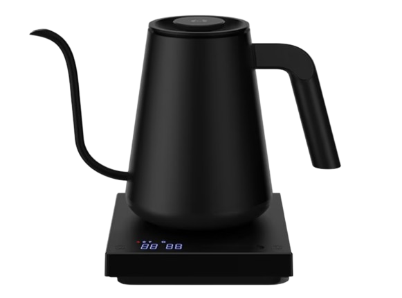

აქვს გუსქნექი, რაც უზრუნველყოფს წყლის
თანაბარ დასხმას
დამზადებულია უჟანგავი ფოლადისგან
ინარჩუნებს ტემპერატურას
აქვს ელექტრო სადგამი, აჩვენებს
ტემპერატურას
Timemore Fish Pro Electric Pour Over
Kettle 900ml | Black

### Timemore Coffee Scale (2000g)

*PDF page 35 · id: `timemore-scale-2000g`*

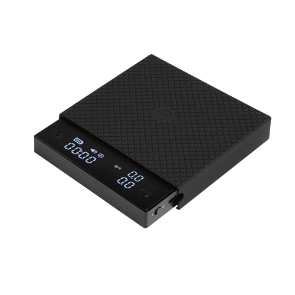

მაქსიმალური წონაა 
ზუსტად გაზომოს 
2000 გრამი და შეუძლია
0,1 გრამიც. იდეალურია
ესპრესოსთვის და ფილტრის ყავისთვის
ეს სასწორი ზომავს ასევე წყლის დასხმის
სიჩქარეს, რომელიც უზრუნველყოფს
 პროფესიონალურად ყავის მომზადებას,ასევე
დროის ათვლა ავტომატურად იწყება, როცა
სასწორი გრძნობს წყლის დასხმას.
სასწორი გრძნობს წყლის დასხმას
Timemore Coffee Scale with Timer

### Timemore U French Press 450ml

*PDF page 36 · id: `timemore-u-french-press`*

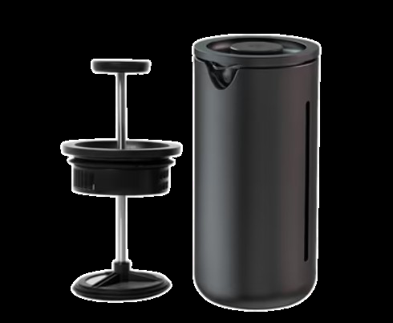

ფრენჩ პრესის სერვერი
450 მლ
18 სმ
Timemore U French Press

### Timemore Hand Grinder S3 ESP – Matt Black

*PDF page 37 · id: `timemore-s3-esp-grinder`*

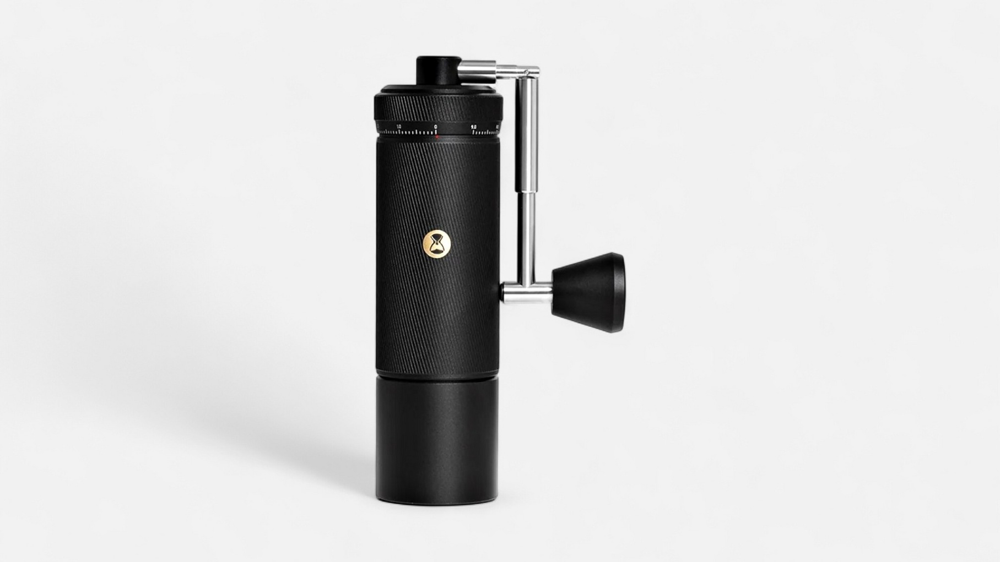

Timemore Hand Grinder S3 ESP –
Matt Black
Timemore Hand Grinder S3 ESP – Matt Black
პრემიუმ კლასის ხელის საფქვავი,
 თანამედროვე დიზაინით და ინოვაციური ტექნოლოგიით.
 აღჭურვილია S2C 890 ტიპის ფოლადის ბურბებით (42 მმ დიამეტრით)
რომლებიც უზრუნველყოფენ სწრაფ, თანაბარ და ეფექტურ დაფქვას,
 განსაკუთრებით ესპრესო და ფილტრის ყავისთვის.
მახასიათებლები:
ბურბი: ფოლადის S2C 890 ტიპი, 42 მმ, სწრაფი და თანაბარი დაფქვისთვის
რეგულირება: გარე სტეპლეის სისტემა, სიზუსტე 0.015 მმ
მასალა: მყარი ალუმინის შენადნობი, უჟანგავი ფოლადი
სახელური: მაგნიტური, მარტივი დასამაგრებლად და მოსახსნელად
მოცულობა: 25 გრამი
წონა: 798 გრამი
დამატებით: სილიკონის რეზინის ბაზა სტაბილურობისთვის
მახასიათებლების უპირატესობა:
გარე საფქვავის სისტემა ითვლება ერთ-ერთ ყველაზე ზუსტად
 რეგულირებად მექანიზმად ხელის საფქვავებში
იდეალურია მათთვის, ვისაც სურს მაღალი სიზუსტის 
დაფქვა სხვადასხვა მეთოდებისთვის (ესპრესო, ფილტრის ყავა და სხვ.)
გამორჩეულია როგორც დიზაინით, ისე ფუნქციონალით

**Video:** https://www.youtube.com/watch?v=hLQFtg40Luw

### Timemore Hand Grinder C3S Max – Black

*PDF page 38 · id: `timemore-c3s-max-grinder`*

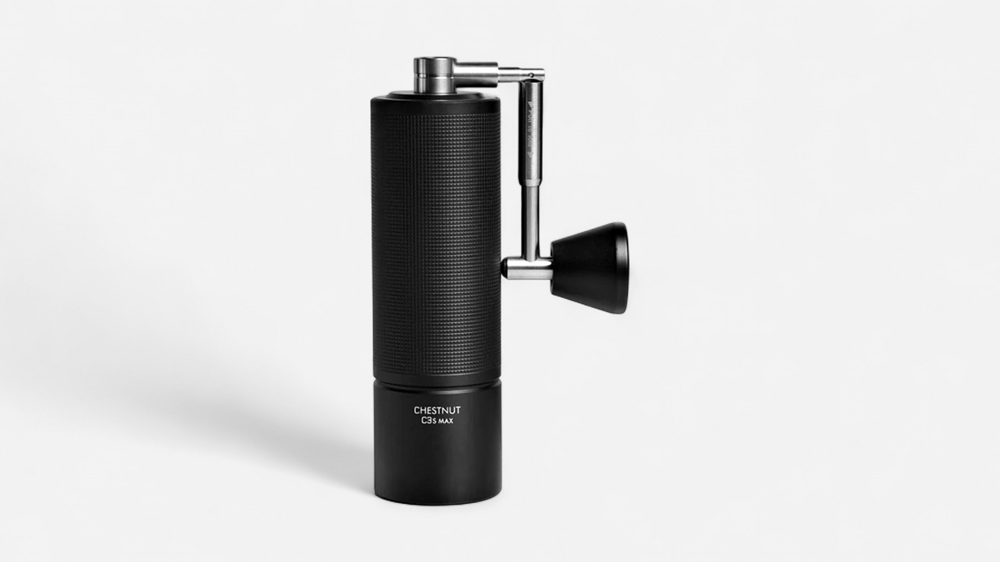

Timemore Hand Grinder C3S Max – Black
Timemore C3S Max – ხელის საფქვავი
პრემიუმ კლასის ხელის საფქვავი სწრაფი, თანაბარი და
ზუსტი დაფქვისთვის.
განახლებული S2C ბურბები (38 მმ) – უზრუნველყოფს
ერთგვაროვან დაფქვას, როგორც ესპრესოსთვის, ისე
ალტერნატიული მეთოდებისთვის (pour-over, AeroPress,
Chemex, French Press).
C3S Max ვერსია – გაზრდილი მოცულობა ერთდროულად
რამდენიმე ჭიქისთვის.
ზუსტი რეგულირება სტეპლეით – 36 პოზიცია, იდეალური
დაფქვის ზომის დასაყენებლად.
მყარი და მსუბუქი ალუმინის კორპუსი, ტექსტურიანი
ზედაპირი – სტაბილურობისა და კომფორტისთვის.
მოხსნადი, ბრუნვადი ალუმინის სახელური – მარტივი
გამოსაყენებლად და გასაწმენდად.
მოცულობა: 30 გრამი | წონა: 585 გრამი
✅ იდეალურია სახლში, ოფისში ან პროფესიონალურ
გამოყენებაში – ხარისხიანი ყავის მოყვარულთათვის და
ბარისტებისთვის.

**Video:** https://www.youtube.com/watch?v=ZXpixbqhyGE

### Timemore Hand Grinder C3S Pro – Black

*PDF page 39 · id: `timemore-c3s-pro-grinder`*

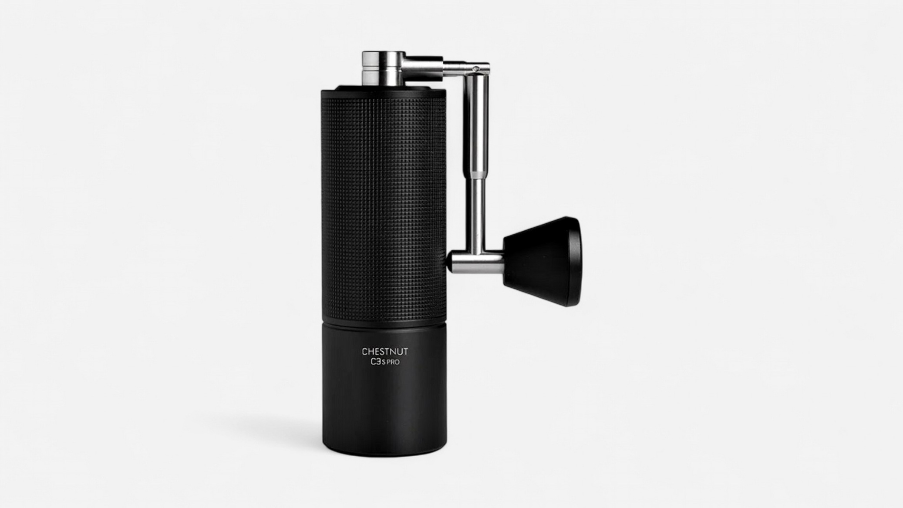

Timemore Hand Grinder C3S Pro-Black
კომპაქტური ხელის საფქვავი – მაღალი ხარისხის მასალებით
კომპაქტური და გამძლე ხელის საფქვავი, შექმნილი მაღალი
ხარისხის მასალებით.
აღჭურვილია S2C (Spike-to-Cut) ტიპის ფოლადის ბურბებით – 38
მმ დიამეტრი, რომლებიც უზრუნველყოფენ თანაბარ, სწრაფ და
სუფთა დაფქვას.
სტეპლეის რეგულირების სისტემა (კლიკებით) საშუალებას
გაძლევთ ზუსტად მოირგოთ საფქვავი ყავის სხვადასხვა
მოსამზადებელი მეთოდისთვის: ესპრესო, პურ-ოვერი, ფრენჩ
პრესი და სხვა.
მთლიანი კორპუსი დამზადებულია ალუმინის შენადნობისგან,
რაც უზრუნველყოფს სიმტკიცეს, სიმსუბუქეს და ელეგანტურ
დიზაინს.
ტექნიკური მახასიათებლები:
ბურბი: ფოლადის S2C ტიპი, 38 მმ
რეგულირება: სტეპლეის სისტემა (კლიკებით)
მასალა: ალუმინი + უჟანგავი ფოლადი
მოცულობა: 25 გრამი
წონა: დაახლოებით 530 გრამი
ზომები: სიმაღლე ~16 სმ, დიამეტრი ~5 სმ
✅ იდეალური არჩევანი როგორც სახლისთვის, ასევე
მოგზაურობისთვის – სტაბილური, კომპაქტური და
მაღალპროფესიული შედეგით.

### Timemore Hand Grinder S3 – Olive Green

*PDF page 40 · id: `timemore-s3-grinder-olive`*

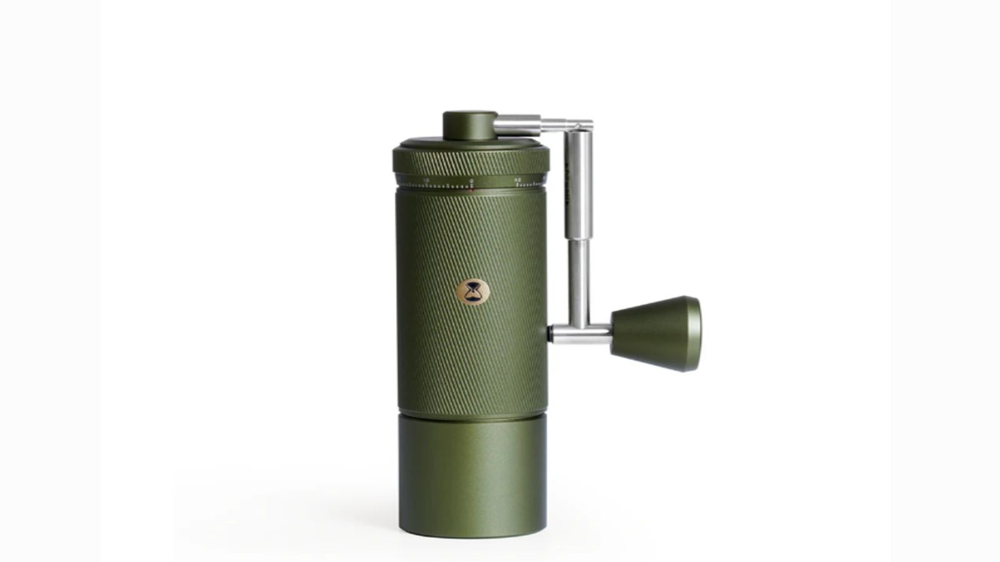

Timemore Hand Grinder S3 – Olive
Green
Timemore S3 – პრემიუმ ხელის საფქვავი
Timemore S3 არის პრემიუმ კლასის ხელის საფქვავი, რომელიც
აერთიანებს გამორჩეულ დიზაინს და უმაღლესი დონის
ფუნქციონალს.
 მოდელი წარმოდგენილია ელეგანტურ ზეთისხილის მწვანე (Olive
Green) ფერში და გამოირჩევა მყარი მეტალის კორპუსით, რაც მას
გამძლესა და სტაბილურს ხდის.
აღჭურვილია S2C 890 ტიპის ფოლადის ბურბებით (42 მმ),
რომლებიც უზრუნველყოფენ თანაბარ და ეფექტურ დაფქვას –
იდეალურია როგორც ესპრესო, ისე ალტერნატიული
მეთოდებისთვის.
 ბურბების სიზუსტე და გარე სტეპლეის რეგულირების სისტემა
საშუალებას გაძლევთ ზუსტად დაარეგულიროთ საფქვავი თქვენი
სასურველი ფქვის სტილისთვის.
ტექნიკური მახასიათებლები:
ბურბი: S2C 890 ფოლადი, 42 მმ დიამეტრი
ფქვის რეგულირება: გარე სტეპლეის სისტემა, სიზუსტე 0.015 მმ
კორპუსი: ალუმინის შენადნობი
სახელური: მაგნიტური სამაგრით, მარტივი დასამაგრებლად და
მოსახსნელად
მოცულობა: 25 გრამი
წონა: დაახლოებით 798 გრამი
ქვედა ნაწილი: სილიკონის ბაზა სტაბილურობისთვის
✅ იდეალური არჩევანი პროფესიონალებისა და ყავის
მოყვარულებისთვის, ვისაც სურს ზუსტი, თანაბარი და
ხარისხიანი დაფქვა.

---

## Mahlkönig

Mahlkönig X64 SD — პროფესიონალური ხარისხისახლში
Mahlkönig X64 SD არის პრემიუმ კლასის საფქვავი, შექმნილი
მათთვის, ვისაც სახლში სურს მიიღოს ბარისტას დონის
სიზუსტე და მაქსიმალურად სუფთა ყავის არომატი. ის
იდეალურად აერთიანებს პროფესიულ ტექნოლოგიასა და
სახლის გამოყენებისთვის საჭირო კომფორტს.
საფქვავი აღჭურვილია 64 მმ ბრტყელი ფოლადის ბურბებით,
რომლებიც უზრუნველყოფს თანაბარ და სტაბილურ დაფქვას
ყავის ყველა მომზადების მეთოდისთვის — ესპრესო, Pour-
Over, AeroPress, French Press და Cold Brew.
რატომ გამოირჩევა X64 SD?
☕ Zero Retention დიზაინი — დაფქული ყავა არ რჩება
საფქვავში
🎯 ყოველთვის სუფთა და ახალი დაფქვა
⚙️ მაღალი სიზუსტე დაფქვის რეგულირებაში
🔄 მარტივი გადართვა სხვადასხვა დაფქვის ზომებს შორის
🖤 პრემიუმ ხარისხის დიზაინი და მასალები
როგორია შედეგი?
X64 SD უზრუნველყოფს:
მაქსიმალურად სუფთა გემოს
სტაბილურ ექსტრაქციას
მდიდარ არომატს ყოველ ფინჯანში
განმეორებად შედეგს ყოველდღიურ გამოყენებაში

### Mahlkönig X64 SD Grinder

*PDF page 41, 42 · id: `mahlkonig-x64-sd`*

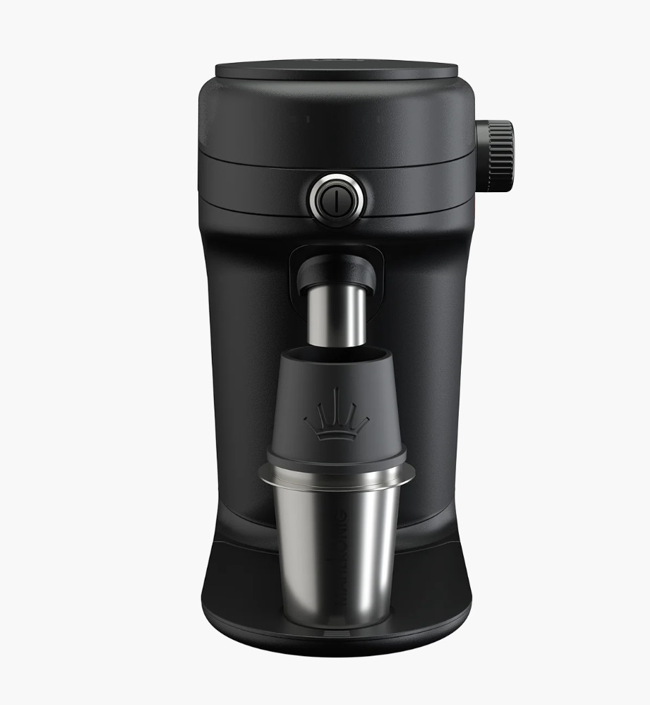
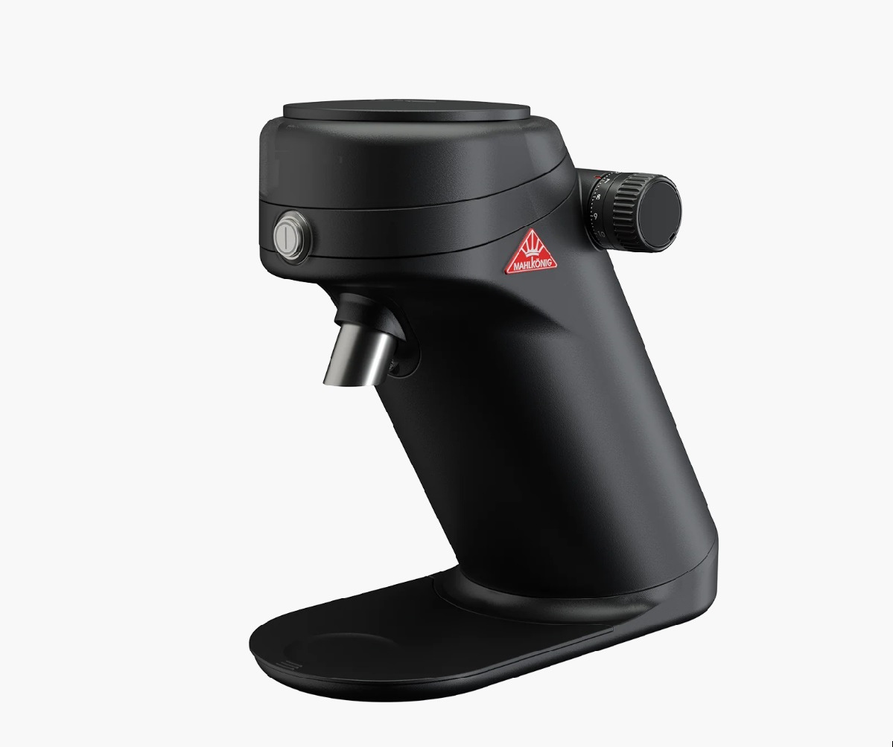

Mahlkönig X64 SD — პროფესიონალური ხარისხისახლში
Mahlkönig X64 SD არის პრემიუმ კლასის საფქვავი, შექმნილი
მათთვის, ვისაც სახლში სურს მიიღოს ბარისტას დონის
სიზუსტე და მაქსიმალურად სუფთა ყავის არომატი. ის
იდეალურად აერთიანებს პროფესიულ ტექნოლოგიასა და
სახლის გამოყენებისთვის საჭირო კომფორტს.
საფქვავი აღჭურვილია 64 მმ ბრტყელი ფოლადის ბურბებით,
რომლებიც უზრუნველყოფს თანაბარ და სტაბილურ დაფქვას
ყავის ყველა მომზადების მეთოდისთვის — ესპრესო, Pour-
Over, AeroPress, French Press და Cold Brew.
რატომ გამოირჩევა X64 SD?
☕ Zero Retention დიზაინი — დაფქული ყავა არ რჩება
საფქვავში
🎯 ყოველთვის სუფთა და ახალი დაფქვა
⚙️ მაღალი სიზუსტე დაფქვის რეგულირებაში
🔄 მარტივი გადართვა სხვადასხვა დაფქვის ზომებს შორის
🖤 პრემიუმ ხარისხის დიზაინი და მასალები
როგორია შედეგი?
X64 SD უზრუნველყოფს:
მაქსიმალურად სუფთა გემოს
სტაბილურ ექსტრაქციას
მდიდარ არომატს ყოველ ფინჯანში
განმეორებად შედეგს ყოველდღიურ გამოყენებაში
ძირითადი პარამეტრები
ბურბები: 64 მმ ბრტყელი (Flat Burrs), მაღალი
ხარისხის სპეციალური ფოლადი
დაფქვის სისტემა: Single Dose + Zero Retention
(ნულოვანი დარჩენა)
დაფქვის რეგულირება: Stepless – შეუზღუდავი,
მიკრონული სიზუსტის კონტროლი
დაფქვის დიაპაზონი: ესპრესოდან ძალიან
მსხვილ დაფქვამდე (Cold Brew).
დაფქვის სიჩქარე: 2.5 – 6 გ/წმ დაფქვის ზომის
მიხედვით
ელექტრონიკა და სიმძლავრე
მოტორი: 200W ძლიერი და ჩუმი ძრავა
ძაბვა: 220–240V / 50–60Hz
ზომები და წონა
ზომები (სიგანე × სიმაღლე × სიღრმე): 14.3 ×
24.9 × 25.3 სმ
წონა: 4.8 კგ
კომპლექტაცია
დოზირების ჭიქა (Dosing Cup)
ჩანასახების ამომყვანი Bellow სისტემა
Anti-Popcorning თავსახური
Hopper Extension
ფერი - შავი

**Video:** https://www.youtube.com/watch?v=hnzAWfpK4kE

---

## Barista Hustle

Barista Hustle – ინოვაცია, სიზუსტე და პროფესიონალური
სტანდარტები ყავის სამყაროში. ბრენდი ქმნის
მაღალხარისხიან აქსესუარებს, რომლებიც ეხმარება
ბარისტებს და ყავის ენთუზიასტებს სრულყოფილი
ექსტრაქციის მიღწევაში. Barista Hustle გაძლევთ
შესაძლებლობას, გააუმჯობესოთ თქვენი უნარები და
მიაღწიოთ იდეალურ შედეგს თითოეულ ჭიქაში.

### Barista Hustle AutoComb (WDT tool)

*PDF page 44 · id: `barista-hustle-autocomb`*

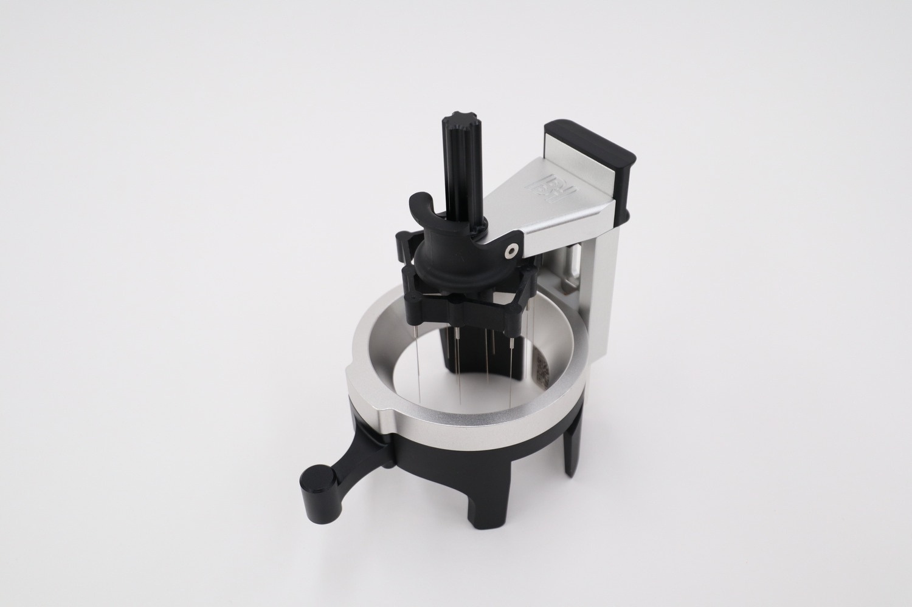

Barista Hustle AutoComb 
Barista Hustle AutoComb არის ხელით მომუშავე 
WDT (Weiss Distribution Technique) ხელსაწყო, 
რომელიც გამოიყენება დაფქული ყავის თანაბრად განაწილებისთვის,
 პორტაფილტერში ესპრესოს მომზადებამდე.
მისი მთავარი დანიშნულებაა კომბების დაშლა და არხების
 (channeling) თავიდან აცილება, რაც ერთ-ერთი ყველაზე ხშირი 
მიზეზია ცუდი ესპრესოს მიღებისას.
როგორ მუშაობს მარტივად:
ხელსაწყოს აქვს 12 ულტრა თხელი ნემსი
ბრუნვისას ნემსები სწრაფად ტრიალებს
დაფქული ყავა ნაწილდება თანაბრად მთელ პორტაფილტერში
შედეგად წყალი გადის თანაბრად და არა ერთ წერტილში
👉 ეს ნიშნავს უკეთეს ექსტრაქციას და უფრო გემრიელ ესპრესოს
რატომ არის AutoComb მნიშვნელოვანი?
☕ აუმჯობესებს ესპრესოს გემოს
🎯 ამცირებს შეცდომის რისკს მომზადებისას
🔁 უზრუნველყოფს ერთნაირ შედეგს ყოველ ჯერზე
⏱ ზოგავს დროს — უფრო სწრაფია, ვიდრე ჩვეულებრივი WDT
✋ არ საჭიროებს ელექტროენერგიას

**Video:** https://www.youtube.com/watch?v=G1wedNJ7h7A

### Barista Hustle Comb (WDT tool)

*PDF page 45 · id: `barista-hustle-comb`*

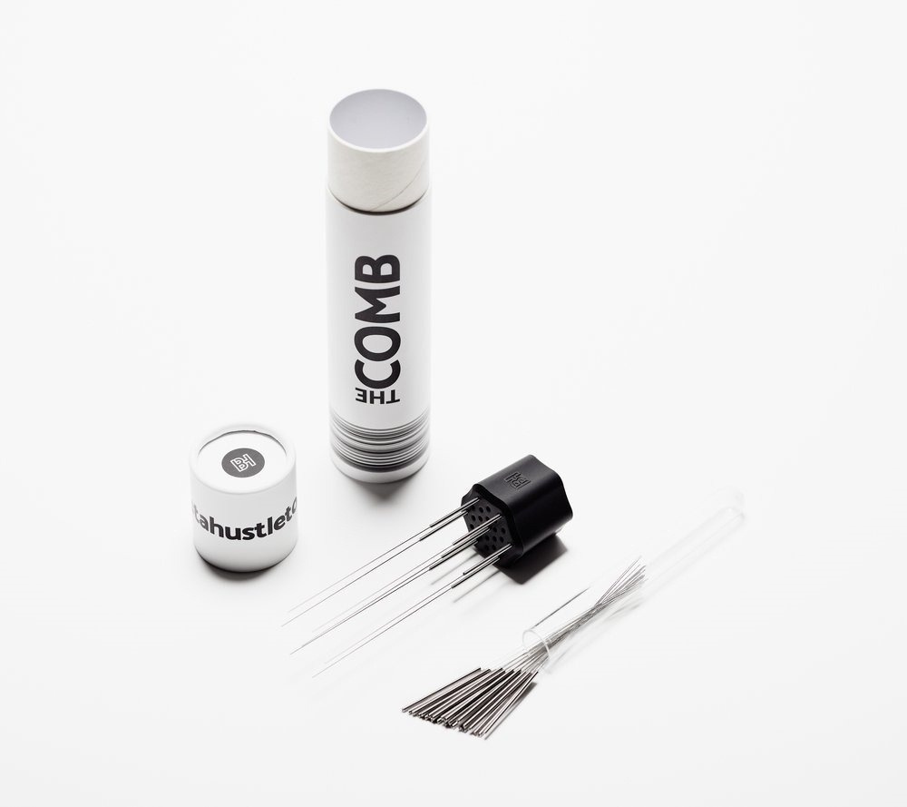

BARISTA HUSTLE COMB
Comb, არის Weiss ხელის
 
გამანაწილებელი ხელსაწყო,
რომელსაც აქვს რბილი,
სილიკონის სახელური, 25
მორგებული და 30 გამძლე უჟანგავი
ფოლადის ნემსი, რაც ძალიან
მნიშვნელოვანია ესპრესოს
მომზადების პროცესში, რათა
დაფქული ყავა თანაბრად და
ერთგვაროვნად გავანაწილოთ.

**Video:** https://www.youtube.com/watch?v=G1wedNJ7h7A

---

## NextLevel

NextLevel Pulsar — ინოვაციური მიდგომა ყავის მომზადებაში
NextLevel Pulsar არის თანამედროვე და
ინოვაციური ყავის მოსამზადებელი მოწყობილობა, 
რომელიც შექმნილია მათთვის, 
ვისაც სურს ყავის ექსტრაქციაზე სრული კონტროლი
 და მაქსიმალურად სუფთა, მდიდარი არომატის მიღება.
Pulsar აერთიანებს უნიკალურ დიზაინს და თანამედროვე ტექნოლოგიას,
რაც მომხმარებელს საშუალებას აძლევს ზუსტად მართოს წყლის ნაკადი, 
კონტაქტის დრო და ექსტრაქციის პროცესი. ეს ქმნის პირობებს,
სადაც ყავის თითოეული ნოტი უკეთ იშლება 
და შედეგი უფრო დაბალანსებული და გამოხატულია.

### NextLevel Pulsar Brewer

*PDF page 46, 47 · id: `nextlevel-pulsar`*

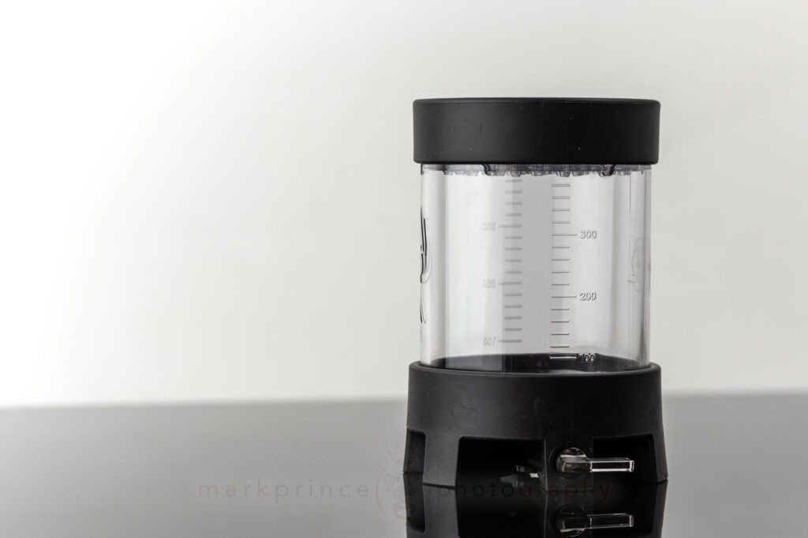
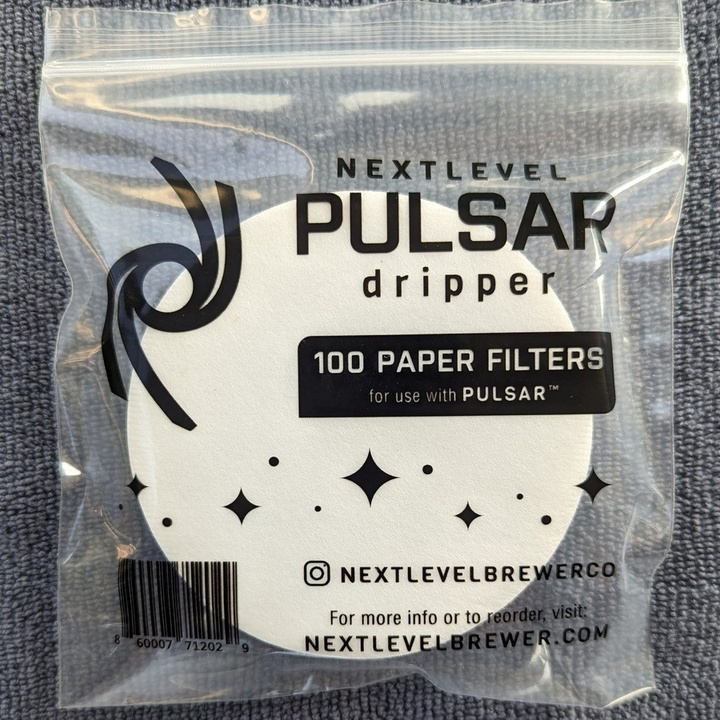

NextLevel Pulsar — ინოვაციური მიდგომა ყავის მომზადებაში
NextLevel Pulsar არის თანამედროვე და
ინოვაციური ყავის მოსამზადებელი მოწყობილობა, 
რომელიც შექმნილია მათთვის, 
ვისაც სურს ყავის ექსტრაქციაზე სრული კონტროლი
 და მაქსიმალურად სუფთა, მდიდარი არომატის მიღება.
Pulsar აერთიანებს უნიკალურ დიზაინს და თანამედროვე ტექნოლოგიას,
რაც მომხმარებელს საშუალებას აძლევს ზუსტად მართოს წყლის ნაკადი, 
კონტაქტის დრო და ექსტრაქციის პროცესი. ეს ქმნის პირობებს,
სადაც ყავის თითოეული ნოტი უკეთ იშლება 
და შედეგი უფრო დაბალანსებული და გამოხატულია.
.
Pulsar აღჭურვილია ნაკადის კონტროლის სარქველით (Flow Control Valve), 
რომელიც მომხმარებელს საშუალებას აძლევს სრულად აკონტროლოს წყლის მოძრაობა ყავაში.
შესაძლებელია წყლის ნაკადის შეჩერება, 
ნელა გაშვება ან სრულად გახსნა — 
ეს ყველაფერი უზრუნველყოფს ექსტრაქციის ზუსტ მართვას და უკეთეს გემოს.
რა გამოარჩევს Pulsar-ს?
☕ თანაბარი ექსტრაქცია — წყალი ნაწილდება ერთგვაროვნად
💧 ნაკადის სრული კონტროლი — სარქველის მეშვეობით
🫖 არ საჭიროებს სპეციალურ ჩაიდანს (gooseneck kettle)
🔬 სპეციალური ფილტრი უზრუნველყოფს სტაბილურ ჩამოსხმას
🎯 მარტივი გამოყენება პროფესიონალებისა და ენთუზიასტებისთვის
როგორ მუშაობს Pulsar მარტივად:
1.ყავა და წყალი თავსდება მოწყობილობაში
2.სარქველი ინარჩუნებს წყალს საჭირო დროით
3.მომხმარებელი თავად წყვეტს ექსტრაქციის დაწყებას
4.ნაკადის რეგულირებით იცვლება ყავის ინტენსიურობა
5.შედეგი — სუფთა, მდიდარი და დაბალანსებული გემო
👉 მეტი კონტროლი = უკეთესი არომატი
ყავის გემო Pulsar-ით
Pulsar განსაკუთრებით კარგად ავლენს:
Specialty ყავის არომატულ პროფილს
ნათელ და სუფთა გემოს
დაბალანსებულ მჟავიანობას
კონტროლირებად სიმკვრივეს (ინტენსიურობას)

**Video:** https://www.youtube.com/watch?v=3GN-MtJZ_Tk

---

## IVYKIN

IVKYN არის თანამედროვე ჩინური ბრენდი,
 რომელიც დაარსდა 2020 წელს და 
სპეციალიზდება პროფესიონალური ყავის აქსესუარების წარმოებაში.
 ბრენდის მიზანია შექმნას ფუნქციური, გამძლე და ესთეტიკური ხელსაწყოები,
 რომლებიც პასუხობს როგორც პროფესიონალი ბარისტების,
 ასევე ყავის მოყვარულების საჭიროებებს.
IVKYN-ის მთავარი პრიორიტეტებია მაღალი ხარისხი,
 ინოვაციური დიზაინი და პრაქტიკულობა. 
ბრენდის პროდუქცია აერთიანებს მინიმალისტურ ვიზუალს, 
გამძლე მასალებსა და ეფექტურ ფუნქციონალს,
 რაც უზრუნველყოფს კომფორტულ და
 საიმედო გამოყენებას ყოველდღიურ პრაქტიკაში.
IVKYN-ის აქსესუარები იდეალურია როგორც პროფესიონალური გარემოსთვის
 — კაფეებსა და ბარებში, 
ასევე სახლის პირობებში ყავის მომზადების რიტუალისთვის, 
სადაც ხარისხი და დეტალებზე ყურადღება გადამწყვეტია.
IVKYN – პროფესიონალი ბრენდი ბარისტებისთვის და
ყავის მოყვარულებისთვის

### IVYKIN Basic Coffee Scale 3kg / 400mAh

*PDF page 49 · id: `ivykin-basic-scale`*

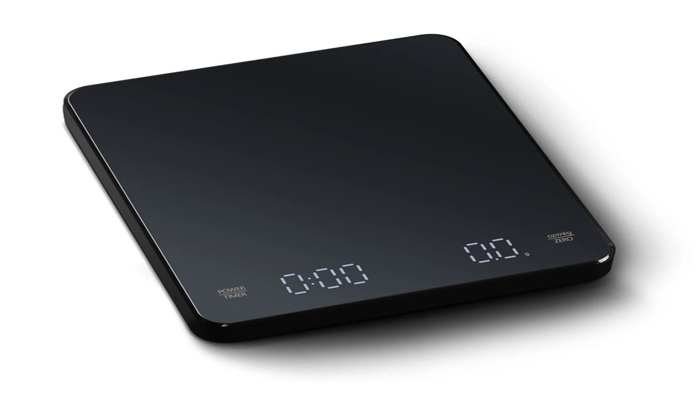

IVYKIN Basic Coffee Scale 3kg / 400mAh
მოდელი: VK2111002
IVYKIN Basic Coffee Scale არის კომპაქტური და ზუსტი ყავის სასწორი,
რომელიც შექმნილია ყავის მომზადების პროცესზე სრული კონტროლის 
უზრუნველსაყოფად. იგი იდეალური არჩევანია
როგორც პროფესიონალი ბარისტებისთვის, 
ასევე სახლის პირობებში ყავის მოყვარულებისთვის.
სასწორი აღჭურვილია ზუსტი წონის გაზომვის სისტემით
და ინტეგრირებული ტაიმერით,
რაც საშუალებას გაძლევთ ერთდროულად აკონტროლოთ
როგორც ყავის დოზა,
ასევე ექსტრაქციის დრო — იქნება ეს ესპრესო თუ ფილტრის ყავა.
როგორ გამოიყენება მარტივად:
აჩვენებს ყავისა და წყლის ზუსტ წონას
ტაიმერი გეხმარებათ ექსტრაქციის დროის კონტროლში
კომპაქტური ზომა მარტივს ხდის ყოველდღიურ გამოყენებას
შესაფერისია ესპრესო აპარატებთან და ფილტრის მეთოდებთან
რატომ არის კარგი არჩევანი?
⚖️ მაღალი სიზუსტე წონის გაზომვაში
⏱ ჩაშენებული ტაიმერი
🔋 400 mAh აკუმულატორი
🔌 USB დატენვა
🖤 მინიმალისტური შავი დიზაინი
🏠 პროფესიული და სახლის გამოყენებისთვის

### IVYKIN Pro Coffee Scale 3kg / 1200mAh

*PDF page 50 · id: `ivykin-pro-scale`*

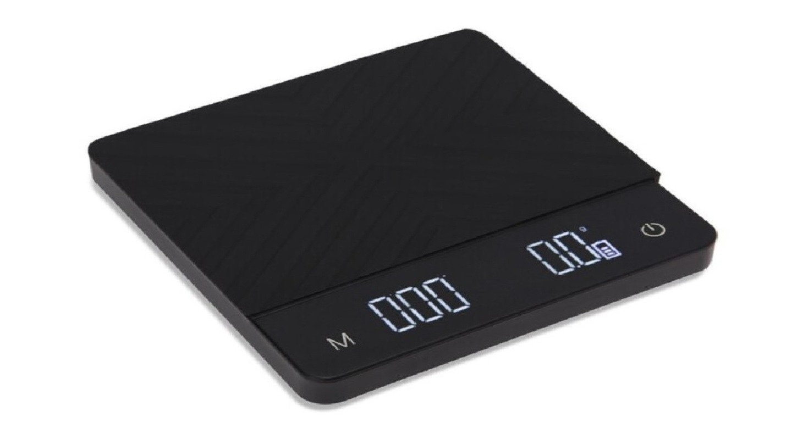

IVYKIN Pro Coffee Scale 3kg / 1200mAh
 ციფრულისასწორი MS-R30A
 აკუმულატორით,
მაღალისიზუსტე პრემიუმ კლასის
სასწორი ტაიმერით და დიდი
ეკრანით
სპეციფიკაცია
ზომა 
მმ
წონა: მაქს 
კგ მინიმუმ 
გ
ზუსტობა 
გ
აკუმულატორი 
მასთ
 დატენვა
განუყოფ ელიელემენტი
 
.
:
: 160 x 115 x 24
.3
, 
0.3
:0.1
:1200 
/
USB
(Unremoveable Battery)

### IVYKIN Cleaning Brush

*PDF page 51 · id: `ivykin-cleaning-brush`*

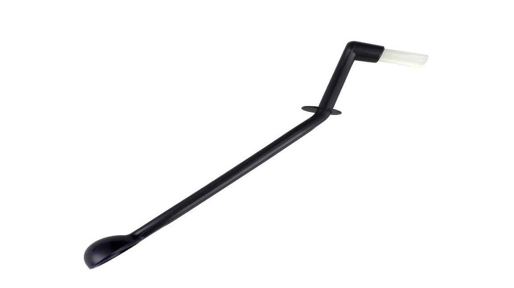

IVYKIN Cleaning brush
საწმენდი ფუნჯი - D000567
ყავის
აპარატისადაფილტრისგასაწმენდა
დ ორფუნქციური ხელსაწყო: ფუნჯი
და ჩაშენებული დოზირების კოვზი.
სახელური: შავიპლასტმასი
ფუნჯი: გამჭვირვალე
სიგრძე: 22 სმ
კოვზისმოცულობა: 3 გ

### IVYKIN Plastic Dripper – Transparent (V60 style)

*PDF page 52 · id: `ivykin-plastic-dripper`*

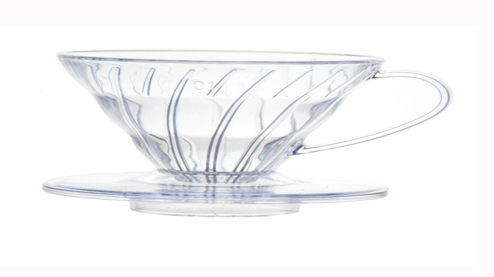

IVYKIN Plastic Dripper l transparent
დრიპ ფილტრი D000237 –
გამჭვირვალე და მედეგი ყავისფილტრი
pour-over ტექნიკისთვის.
ზომა: 101
მასალა: პლასტმასი
იდეალურია V60
სტილისმოსამ ზადებლად

### IVYKIN Silicone Tamping Mat

*PDF page 53 · id: `ivykin-tamping-mat`*

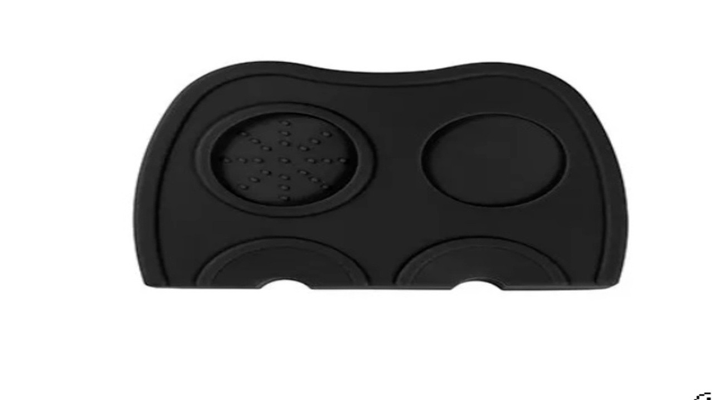

IVYKIN Silicone material tamping mat
თამპერის მატ VK2203151 –
მყარი და ფუნქციური ბაზა თამპერისთვის ბარისტას
აუცილებელიხელსაწყო.
იცავსზედაპირსდაზიანებისგანთამპერისგამოყენებისას.
მახასიათებლები:
მასალა: სილიკონი
ფერი: შავი
ზომა: 21 x 15 სმ
მდგრადიაწყლისადამაღალიტემპერატურისმიმართ

### IVYKIN Wooden-handle Coffee Kettle 700ml

*PDF page 54 · id: `ivykin-wooden-kettle-700`*

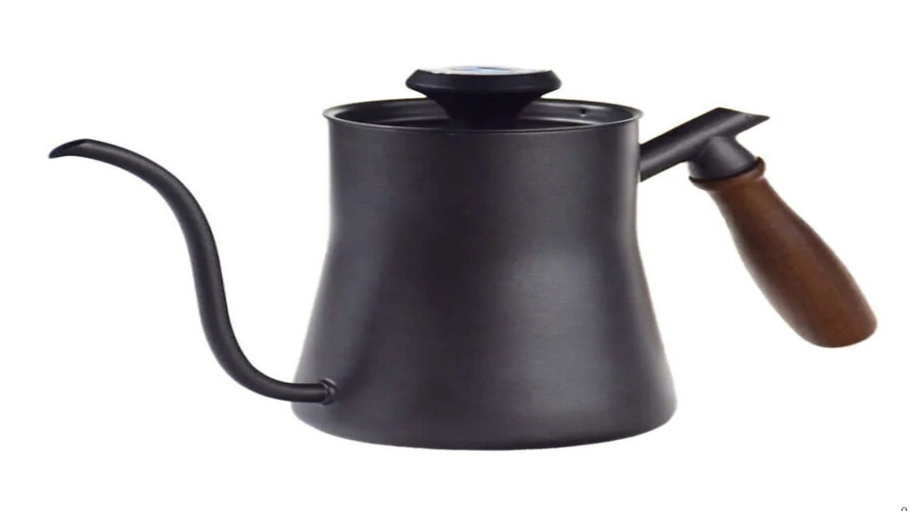

IVYKIN Wooden handle Coffee kettle 700ml
ყავის ჩაიდანი VK2202181
მახასიათებლები:
მოც ულობა: 700 მლ
მასალა: უჟანგავიფოლადი 304
შავი საფარი შიგნიდან და გარედან 
ხისსახელური –
თერმულიიზოლაციით

---
